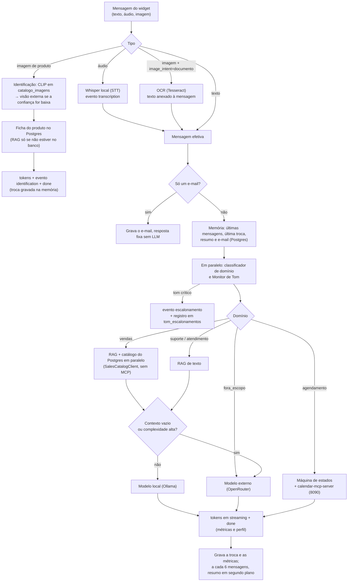

# Arquitetura — Assistente Virtual Multimodal com Roteador Inteligente

> Fonte: adaptado do documento de proposta ao orientador (TCC). Este documento
> é a referência técnica única de arquitetura e escopo — mantenha-o
> atualizado conforme decisões mudam durante o desenvolvimento. `CLAUDE.md` e
> `.agents/rules/project.md` apontam para cá; não duplique decisões neles.

## 1. Objetivo do projeto

Assistente virtual multimodal (texto, imagem e áudio) capaz de atender
clientes em quatro domínios: Vendas, Suporte Técnico, Atendimento ao Usuário e
Agendamento de Visita. O sistema combina um modelo de IA executado localmente
em GPU (16GB) com a possibilidade de acionar modelos externos quando
necessário, apoiado por um Roteador/Orquestrador que interpreta a intenção do
usuário e decide o caminho mais adequado — incluindo busca aumentada por
recuperação (RAG) em bases de dados, documentos, sites e imagens, e o
acionamento de MCPs (Model Context Protocol) em duas direções:

- **Como cliente** de um MCP externo, para marcar visitas diretamente no
  Google Calendar.
- **Como provedor** de um MCP próprio, que expõe catálogo de produtos,
  estoque, preços e manuais, além de ferramentas de validação de
  compatibilidade, frete, cotação e reserva/pedido — tanto para o próprio chat
  quanto para IAs de parceiros integradores.

Além da conversa em si, o sistema reconhece o perfil do usuário (cliente,
lead ou contato esporádico), mantém memória entre interações e monitora o
tom da conversa para acionar um atendente humano quando necessário.

## 2. Visão geral da arquitetura

Fluxo macro: entrada multimodal → pré-processamento (STT para áudio, OCR para
imagem) → Roteador/Orquestrador (intenção + perfil do usuário) → módulos de
domínio (RAG, modelo local, modelo externo, monitor de tom, classificação de
usuário) → MCPs (Google Calendar consumido; MCP B2B provido) → resposta ao
usuário.

```
Entrada multimodal (texto / áudio / imagem)
        │
        ▼
Pré-processamento (STT / OCR)
        │
        ▼
Roteador / Orquestrador  ──── (paralelo) ──── Monitor de tom
        │                                          │
        ├──► RAG (BD, PDFs, sites, imagens)        ├──► Atendente humano
        ├──► Modelo local (GPU 16GB)                    (transferência)
        ├──► Modelo externo
        ├──► MCP Google Calendar (agendamento)
        └──► MCP B2B (catálogo, estoque, preços — provido)
        │
        ▼
   Resposta ao usuário
```

Este diagrama cobre a arquitetura de IA/backend. A interface que o usuário
efetivamente usa (site institucional, produtos, pedidos e o widget de chat
que expõe esse fluxo) é documentada separadamente em `docs/FRONTEND.md`.

### Fluxo de uma mensagem no chat (`POST /api/chat/messages`)

Trazido do antigo `docs/Manuais/DIAGRAMA_FLUXO_CHAT.md` e corrigido contra o
código em 2026-09-28 (o diagrama antigo tinha um domínio `pos_venda`
inexistente, Vendas passando pelo MCP B2B e o Monitor de Tom depois da
resposta). Contrato dos eventos SSE: `docs/FRONTEND.md` §4.



| Entrada | Pré-processamento | Caminho | Eventos SSE |
| --- | --- | --- | --- |
| Texto | — | Memória → classificador e Monitor de Tom → domínio → local ou externo | `conversation`, `status` (se o modelo local estiver carregando), `token`, `escalonamento` (opcional), `done` |
| Áudio | Whisper (`SttClient`) | Transcrição → mesmo caminho do texto | `conversation`, `transcription`, `token`, `done` |
| Imagem de produto | Validação do formato | Identificação (CLIP → visão externa) → ficha do banco ou RAG | `conversation`, `token`, `identification`, `done` |
| Imagem de documento (`image_intent=documento`) | OCR | Texto extraído anexado → mesmo caminho do texto | `conversation`, `token`, `done` |
| Só um e-mail | Regex | Grava o e-mail, resposta fixa | `conversation`, `token`, `done` |

Falha de dependência (Ollama, OpenRouter, RAG) vira o evento `error` com
"Serviço temporariamente indisponível".

### Escolhas de tecnologia e alternativas consideradas

Versões e bibliotecas em uso: `docs/CONVENTIONS.md`, seção "Stack". Aqui fica
só o porquê de cada escolha central (conteúdo trazido do antigo
`docs/TECHNOLOGY_STACK.md` na consolidação de 2026-09-28).

- **PostgreSQL, não MongoDB:** os dados são relacionais (produto ↔ estoque
  ↔ pedido ↔ compatibilidade), reserva de pedido precisa de transação ACID,
  e o conector de BD do RAG (R4) lê SQL. É o backend único de catálogo,
  estoque, preços, conversas e perfil.
- **Qdrant, não Pinecone/Weaviate:** open-source, roda num container ao lado
  do resto (sem custo de nuvem), com filtro nativo por payload (domínio,
  categoria), suficiente para o volume do protótipo.
- **Ollama, não vLLM, como runtime local:** API HTTP simples, troca de
  modelo trivial (`ollama pull`) e devolve tokens e tempos (carga x
  geração) em cada resposta, o que reduz o código de instrumentação da
  avaliação (`docs/EVALUATION.md`). O vLLM daria mais vazão sob
  concorrência, desnecessária num protótipo sem carga real.
- **OpenRouter como modelo externo:** uma chave para vários provedores e
  modelos, API no formato OpenAI; o externo só entra quando o roteador
  escala.
- **Next.js separado do FastAPI:** o chat precisa de um frontend dedicado
  (streaming SSE, gravação de áudio, upload de imagem); o backend fica só
  como API.

## 3. Requisitos funcionais

| # | Requisito |
| --- | --- |
| R1 | Modelo de IA rodando localmente em GPU de 16GB, sem depender de nuvem para as tarefas essenciais. |
| R2 | Entrada de chat multimodal: aceitar texto, imagem e áudio. |
| R3 | Roteador/Orquestrador que identifica a intenção do usuário e decide entre modelo interno ou externo. |
| R4 | RAG capaz de buscar em banco de dados, textos, PDFs, sites e banco de imagens. |
| R5 | Conversão de áudio em texto (STT) antes da análise e contextualização no chat. |
| R6 | Tratamento de imagem: uso dirigido (ex.: comprovante solicitado) ou uso espontâneo (busca de produto interno, com fallback para busca externa) — via OCR e identificação de imagem. |
| R7 | Domínios de atendimento: Vendas, Suporte Técnico, Atendimento ao Usuário e Agendamento de Visita, com identificação de intenção pelo orquestrador. |
| R8 | Monitoramento contínuo do tom da conversa, com transferência para atendente humano em casos de urgência ou insatisfação. |
| R9 | Armazenamento da conversa com identificação única, permitindo retomar com um resumo do histórico recente. |
| R10 | Classificação do usuário ao longo da conversa como Cliente, Lead ou Cliente Esporádico. |
| R11 | Módulo de agendamento de visita, reconhecido como intenção própria pelo roteador, que aciona um MCP — preferencialmente o do Google Calendar — para criar o evento. |
| R12 | Exposição de um MCP próprio pela empresa (servidor/provedor), disponibilizando catálogo, estoque, preços e documentação técnica, além de ferramentas de validação de compatibilidade, frete, cotação e reserva/pedido, para uso por IAs de parceiros integradores e, internamente, pelo próprio Roteador/Orquestrador. |

**Assimetria intencional entre domínios:** Vendas e Agendamento de Visita
contam, desde o MVP, com ferramentas de ação (o MCP B2B da Seção 6 e o MCP do
Google Calendar, respectivamente). Suporte Técnico e Atendimento ao Usuário
são resolvidos, no protótipo, pela combinação de LLM e RAG (textos, PDFs,
manuais, crawler do site), sem uma camada de ação dedicada — abrir/acompanhar
chamados via ticketing é evolução futura (ver Seção 6 e `docs/ROADMAP.md`).

## 4. Fluxos de decisão: imagem e monitoramento de tom

**(a) Tratamento de imagem:** imagem recebida → o sistema **solicitou** um
comprovante/documento (fluxo dirigido)? → **sim:** OCR + validação. → **não**
(padrão — o cliente nunca envia imagem para OCR sem solicitação): fluxo de
**identificação de produto**.

> **Decisão registrada (Fase 3, 2026-09-20 — fluxo de imagem e fallback
> externo):** o padrão para qualquer imagem enviada no chat é a
> **identificação de produto**; o OCR é a exceção, acionado apenas quando o
> sistema solicitou explicitamente um comprovante/extrato. No contrato do
> chat isso é sinalizado por `image_intent`: ausente/`"produto"` → fluxo de
> identificação (padrão); `"documento"` → OCR (comportamento atual). A regra
> de negócio que faz o assistente *pedir* um comprovante (e assim ativar o
> modo OCR do lado do servidor) depende de estado de conversa das Fases 4/6;
> por ora o gatilho do modo documento é carregado pelo frontend quando o
> assistente pede o comprovante.
>
> **Fluxo de identificação de produto** (motor em
> `app.rag.image_identification`, endpoint `POST /api/rag/images/identify` e
> integração no chat):
> 1. **Catálogo interno (CLIP):** embeda a imagem e busca em
>    `catalogo_imagens`. Se o melhor score ≥ `IMAGE_INTERNAL_CONFIDENCE`
>    (limiar alto, default 0.30, configurável em runtime) → retorna o produto
>    do catálogo, sem chamar o externo.
> 2. **Visão externa (fallback):** se o interno não teve confiança
>    suficiente, consulta um modelo de visão via OpenRouter
>    (`EXTERNAL_VISION_MODEL_NAME`) pedindo resposta objetiva em JSON:
>    `{"produto": "<nome>", "e_do_portfolio": bool, "confianca": 0..1}`. O
>    prompt informa o portfólio da empresa: **produtos de segurança —
>    câmeras, sensores, automação, equipamentos de rede, catracas
>    eletrônicas, identificadores biométricos e gravadores de imagem**.
> 3. **Decisão:** se `e_do_portfolio == true` **e**
>    `confianca >= IMAGE_EXTERNAL_CONFIDENCE` (limiar alto, default 0.80,
>    configurável) → usa o nome retornado (mais o contexto de mensagens
>    recentes do usuário, quando houver) para buscar no **RAG de texto**
>    (`docs_texto`) e retorna os detalhes do produto. Caso contrário (não é
>    do portfólio, confiança baixa, ou resposta não-parseável) → responde
>    objetivamente que **não identificou o produto**.
> 4. **Detalhes vêm do banco (decisão de 2026-09-27):** produto é dado do
>    cadastro (`produtos` no Postgres); PDFs no RAG ficam para manuais e
>    documentação. Achado o produto (passo 1 com `produto_id` no payload da
>    foto, ou nome casando com um único produto do cadastro — nome da foto
>    sem `produto_id` ou nome devolvido pela visão externa), os detalhes são
>    a ficha do banco: descrição comercial, especificações técnicas,
>    dimensões e peso, com o nome do cadastro no "Identifiquei: …". Sem
>    produto no banco (ou com o banco fora do ar), cai na busca no RAG de
>    texto do passo 3, como antes. `# MVP: casamento por nome só aceita um
>    candidato único (nome contido um no outro, sem acentos); sem ranking.`
>
> Os três parâmetros (`EXTERNAL_VISION_MODEL_NAME`, `IMAGE_INTERNAL_CONFIDENCE`,
> `IMAGE_EXTERNAL_CONFIDENCE`) têm default no `.env` (apenas para popular o
> frontend) e são ajustáveis em runtime via `GET`/`PUT
> /api/admin/runtime-settings`, exibidos na tela `/admin/modelos`. `# MVP:
> chamada a provedor externo pago no fluxo de imagem — decisão consciente,
> não evolução futura; sem busca reversa de imagem nem catálogo visual
> externo, o "externo" é um modelo de visão que só nomeia/classifica o
> produto`.

**(b) Monitoramento de tom e transbordo humano:** nova mensagem no chat → classificador de
sentimento/urgência → ultrapassou o limiar de urgência/insatisfação? →
**não:** fluxo normal continua. → **sim:** alerta e registro para
acompanhamento humano (`tom_escalonamentos`). A especificação de arquitetura para a central de atendimento ao vivo e fila de suporte com transbordo humano (*Live Agent Takeover* com locks atômicos) está detalhada em `docs/superpowers/specs/2026-10-03-atendimento-humano-transbordo-design.md`.

## 5. Escopo do MVP e evolução futura

Três decisões de escopo:

1. Integração com CRM está **fora do escopo** do projeto.
2. Agendamento de visita é uma nova intenção do roteador que aciona um MCP
   **externo** (preferencialmente Google Calendar), em vez de um módulo de
   agenda construído internamente.
3. O MCP de integração B2B (R12) nasce como **servidor interno**, consumido
   primeiro pelo próprio chat, e só evolui para exposição real a parceiros
   externos depois (ver Seção 6).

R4 estabelece que o RAG deve buscar em BD, textos, PDFs, sites e banco de
imagens — por isso, conector a BD relacional, crawler de sites e RAG
multimodal sobre imagens são **obrigatórios no MVP**, não itens adiáveis, mas
entram em versões simplificadas frente a uma versão de produção: o conector
ao BD é somente leitura, sem sincronização incremental; o crawler navega de
verdade a partir de uma URL semente informada pelo admin, com profundidade e
teto de páginas parametrizáveis por execução, disparo sempre manual, sem
agendamento; o catálogo de imagens do RAG multimodal é ampliado, mas ainda
não completo, com reranking básico dos resultados.

**Decisão registrada (Fase 2, resolve divergência entre o comentário original
de `orchestrator.py` e o spec de design da Fase 1):** ao trocar o
`NullRAGClient` pela busca vetorial real no Qdrant, o conteúdo dos documentos
recuperados passa a ser **injetado no prompt do LLM** (a resposta fica
fundamentada no que está nos PDFs/textos indexados), não só usado como sinal
binário (vazio/não-vazio) para a decisão local x externo — esse sinal
continua existindo (ainda decide o roteamento), mas deixa de ser o único
efeito da busca. Sem isso, ter RAG de verdade não mudaria a qualidade da
resposta, só a decisão de roteamento.

**Decisão registrada (Fase 2):** a ingestão de documentos no RAG passa a ter
um segundo caminho além do script `backend/scripts/ingest_sample_docs.py` —
um endpoint HTTP (`POST /api/rag/documents`, upload de PDF/texto +
`domain`) e uma página administrativa simples no frontend (`/admin/ingestao`,
fora da navegação pública) que o consome. O script continua existindo para
ingestão em lote/repetível; o endpoint cobre o caso de adicionar um
documento avulso sem precisar de acesso ao terminal do servidor. Reabre
parcialmente a exclusão geral de "painel administrativo" que constava em
`docs/FRONTEND.md` §8 (ver decisão revista lá) — mantida para
catálogo/estoque/preços, mas não mais uma proibição geral. `# MVP:` mesmas
simplificações do script — sem autenticação (rota não listada na navegação
pública, mas não protegida por login), sem deduplicação/reingestão
incremental (mesma limitação de `app.rag.qdrant_client.upsert_chunks`).

**Decisão registrada (além do MVP, a pedido explícito, 2026-09-14):** toda
ingestão de documento no RAG (endpoint HTTP ou script em lote) passa a criar
um registro persistente no Postgres (`rag_documents`) — o primeiro uso real
dessa infraestrutura, até então só prevista em config/`docker-compose.yml`.
A partir desse registro, um documento pode ser listado e excluído (linha do
Postgres + pontos correspondentes no Qdrant, amarrados por um `document_id`
gravado no payload de cada ponto). Esta funcionalidade **não faz parte do
MVP original** — foi implementada por pedido explícito do usuário antes de
retomar os itens pendentes da Fase 2 (conector de BD relacional, crawler).
Fica registrada aqui para não ser confundida com um item do escopo original
nem esquecida na revisão final (Fase 11). Detalhes de implementação:
`docs/superpowers/specs/2026-09-14-registro-documentos-rag-design.md`.

**Decisão registrada (além do MVP, a pedido explícito, 2026-09-15):** o
registro de documentos acima evolui para **múltiplos perfis de collection**
configuráveis (chunk size/overlap, modelo de embedding, dimensão, métrica de
distância, HNSW, quantização de vetores, payload indexing do Qdrant) —
Entregas B e C+D anunciadas como "spec futura" na decisão anterior, agora
combinadas numa só entrega por ficarem interdependentes. Cada collection é um
perfil imutável (mudar um parâmetro é criar uma nova collection); uma delas é
marcada como "ativa" e é a que o chat de fato usa, enquanto as demais servem
para comparação num playground de busca administrativo (pergunta única
rodada contra várias collections, resultados/score/latência lado a lado, sem
métrica agregada de qualidade — isso continua reservado para a Fase 10,
Avaliação Experimental). Documentos ganham um arquivo original salvo em
disco (`backend/data/rag_uploads/`), permitindo reingerir o mesmo documento
em outra collection para comparação. Como a entrega anterior, **não faz
parte do MVP original** — fica registrada aqui e no roadmap para não ser
confundida com item do escopo original nem esquecida na revisão final (Fase
11). Detalhes de implementação:
`docs/superpowers/specs/2026-09-15-rag-collections-config-design.md`.

**Decisão registrada (além do MVP, a pedido explícito, 2026-09-21):**
collections ganham um campo de **finalidade** (`purpose`): `chat` (default,
pública, elegível a ser ativada e buscada pelo chat) vs `mcp_b2b` (restrita
ao canal MCP B2B). O admin pode ingerir, pela mesma tela `/admin/ingestao`,
documentação **exclusiva do canal MCP B2B** numa collection dedicada
`purpose="mcp_b2b"`, que **nunca é ativada** (a ativação é bloqueada com 409)
nem buscada pelo chat público — há ainda uma guarda de defesa em profundidade
em `ActiveCollectionRagClient.search` que falha fechado caso a invariante
seja quebrada. A **metade de consumo** desse conteúdo (o servidor MCP B2B de
fato lendo a collection restrita) permanece na **Fase 5 (R12)**, não
antecipada aqui — por ora o conteúdo fica ingerido e isolado, sem consumidor.
Segue **fora do MVP** tudo que caracteriza acesso externo real: autenticação
por parceiro, isolamento multi-tenant, exposição pública, rate limiting e
auditoria (revisto em 2026-09-25: exposição pública com chave por parceiro
entrou no MVP, ver Seção 6) (ver seção "Explicitamente fora do MVP" no roadmap). Como as demais
entregas fora do MVP, fica registrada aqui e no roadmap para não ser
confundida com item do escopo original nem esquecida na revisão final (Fase
11). Detalhes de implementação:
`docs/superpowers/specs/2026-09-21-ingestao-mcp-b2b-design.md`.

**Decisão registrada (além do MVP, a pedido explícito, 2026-09-16):** uma
tela administrativa (`/admin/modelos`) passa a permitir listar os modelos
locais já baixados no Ollama, trocar em runtime qual deles o chat usa, e
baixar um novo — tanto da biblioteca padrão do Ollama quanto um GGUF
hospedado no Hugging Face (`ollama pull hf.co/<usuário>/<repo>`, suportado
nativamente pelo Ollama, sem motor de inferência adicional). O download
roda em background (nunca bloqueia o backend), com progresso acompanhado
por polling a partir do frontend. A seleção de modelo ativo fica só em
memória (reseta a cada restart) e **não substitui nem antecipa** a decisão
formal da Fase 10 (escolha do `LOCAL_MODEL_NAME` de produção via benchmark
offline contra o sistema completo) — é uma ferramenta de teste manual em
paralelo. Como as entregas anteriores fora do MVP, fica registrada aqui e
no roadmap para não ser confundida com item do escopo original nem
esquecida na revisão final (Fase 11). Detalhes de implementação:
`docs/superpowers/specs/2026-09-16-local-model-manager-design.md`.

**Decisão registrada (além do MVP, a pedido explícito, 2026-09-17):** a
mesma tela (`/admin/modelos`) ganhou uma seção "Parâmetros de execução"
para ajustar em runtime (**atualização de 2026-10-03: estes parâmetros
passaram a ser também persistidos em Postgres e restaurados no boot — ver
a decisão "Residência do modelo local na VRAM..." mais abaixo nesta
seção; o restante deste parágrafo descreve só o estado em 2026-09-17**):
a temperatura do modelo local (`OllamaClient.temperature`, `null` = usa o
default do próprio modelo — nenhuma chamada manda `options.temperature`
até alguém setar um valor explícito, sem mudar o comportamento anterior),
o timeout das chamadas não-streaming ao backend local e ao externo
(`OllamaClient.timeout_s`/`OpenRouterClient.timeout_s`), e a flag
`QdrantRAGClient.search_domain_fallback` (antes só configurável via
`.env`/restart, ver decisão de 2026-09-17 acima sobre o bug de isolamento
de domínio). Um único endpoint, `GET`/`PUT /api/admin/runtime-settings`
(`PUT` com atualização parcial — só os campos enviados mudam), cobre os
quatro parâmetros, já que eles tocam três clients diferentes (Ollama,
OpenRouter, Qdrant) e não fazem sentido debaixo do prefixo
`/api/admin/local-models`. Motivo direto: a temperatura do Ollama também é
usada pela chamada de classificação de intenção do roteador (mesmo
client/model) — baixá-la reduz a instabilidade de classificação
observada em mensagens de acompanhamento ambíguas, sem precisar de uma
chamada de classificação separada com `temperature` fixo. `# MVP: não
substitui a escolha formal de hiperparâmetros da Fase 10` (a persistência
entre restarts, ausente quando este parágrafo foi escrito, foi adicionada
na decisão de 2026-10-03 citada acima).

**Decisão registrada (além do MVP, a pedido do desenvolvedor, 2026-09-27;
registrada na revisão de 2026-09-28):** a tela `/admin/modelos` ganhou o
card "Modelo externo (OpenRouter)" (`OpenRouterModelCard.tsx`), que troca em
runtime o modelo de texto do OpenRouter pelo campo `external_model_name` de
`GET`/`PUT /api/admin/runtime-settings` (`OpenRouterClient.model`), com uma
lista de sugestões ("populares" e "gratuitos", sufixo `:free`) e um
histórico dos modelos já usados. O mesmo cliente atende as respostas
escaladas para o externo, o classificador Jev e o Monitor de Tom, então a
troca vale para os três. `# MVP: lista de sugestões fixa no frontend, sem
consultar o catálogo do OpenRouter; histórico só no localStorage do
navegador` (a persistência entre restarts, ausente quando este parágrafo
foi escrito, foi adicionada na decisão de 2026-10-03 citada acima). Risco
conhecido: modelos `:free` têm limite de requisições
baixo, e o 429 do OpenRouter aparece para o cliente como "Serviço
temporariamente indisponível" (visto no teste local de 2026-09-27).

**Decisão registrada (Fase 2, conector de BD relacional exigido por R4,
2026-09-16):** o conector de leitura a BD relacional reaproveita o mesmo
Postgres já provisionado em `docker-compose.yml` (o mesmo usado por
`rag_documents`/`rag_collections`) — sem infraestrutura nova. Uma tabela
fixture fictícia, `produtos` (`id`, `nome`, `descricao`, `preco`,
`categoria`), é criada e semeada por migração Alembic
(`backend/migrations/versions/0003_produtos_fixture.py`), análoga em
espírito a `backend/scripts/sample_docs/` para PDFs/textos, mas para dados
estruturados; seus dados fictícios são coerentes com o catálogo de exemplo já
usado no RAG (geradores a diesel e acessórios, ver
`backend/scripts/sample_docs/vendas/catalogo_geradores.txt`). A leitura em si
(`app.rag.db_connector.read_table_as_text`) é genérica via reflexão de tabela
do SQLAlchemy (`Table(..., autoload_with=...)`) — recebe nome de
tabela/colunas e devolve linhas transformadas em texto (`coluna: valor` por
linha), não fica acoplada à tabela `produtos`. Cada linha lida é ingerida
como um documento próprio no RAG, reaproveitando `app.rag.ingest.ingest_bytes`
sem duplicar chunking/embedding/upsert (o texto da linha vira o "conteúdo do
arquivo", com um nome sintético `<tabela>_row<N>.txt`). Exposto só como
script CLI (`backend/scripts/ingest_db_table.py --table <nome> --domain
<dominio>`), no mesmo padrão de `backend/scripts/ingest_sample_docs.py` — sem
endpoint HTTP dedicado (diferente da ingestão de PDF/texto, que já tinha essa
necessidade validada via `/admin/ingestao`; aqui o caso de uso é
administrativo/pontual via terminal, sem tela nova no frontend). `# MVP:
somente leitura (sem INSERT/UPDATE/DELETE no BD de origem) e sem
sincronização incremental (execução manual sob demanda, sem agendamento nem
observação de mudanças) — mesma limitação de deduplicação/reingestão já
aceita em `app.rag.qdrant_client.upsert_chunks``.

**Decisão registrada (Fase 2, correção de revisão, 2026-09-16):**
`app.rag.db_connector.read_table_as_text` reforça a garantia de "somente
leitura" acima com a opção de execução `postgresql_readonly=True`
(`connection.execution_options(...)`, dialect-specific do Postgres, banco de
produção deste conector) — faz o próprio banco rejeitar qualquer
INSERT/UPDATE/DELETE acidental durante a leitura, sem precisar de uma role de
BD dedicada (infraestrutura nova, fora de escopo do MVP). Dialetos sem essa
opção (ex.: SQLite, usado nos testes) simplesmente a ignoram.

**Decisão registrada (Fase 2, correção de revisão, 2026-09-16):**
`QdrantRAGClient.create_collection` usa um `asyncio.Lock` por instância para
evitar a corrida TOCTOU entre checar se a collection já existe e criá-la de
fato (duas requisições concorrentes de criação com o mesmo nome não devem
colidir no erro genérico do Qdrant em vez do `CollectionAlreadyExistsError`
tratado). Funciona porque `QdrantRAGClient` é injetado como singleton por
processo (`request.app.state.qdrant_client`, ver `rag_dependencies.py`).
`# MVP: protege apenas concorrência dentro de um único worker Uvicorn — não
protege contra múltiplas instâncias/processos do backend rodando
simultaneamente contra o mesmo Qdrant`, o que é aceitável para o cenário de
desenvolvimento/demonstração deste protótipo (um único processo backend).

**Decisão registrada (Fase 3, R6, OCR para imagens dirigidas):**
`POST /api/chat/messages` passou a aceitar um campo `image` (base64,
PNG/JPG/WEBP). Quando presente, o OCR extrai o texto da imagem via
`pytesseract` (Tesseract 5.x, idiomas `por+eng`) e o concatena à mensagem
efetiva antes de passar ao orchestrator — o texto extraído é injetado como
contexto adicional, não substitui a mensagem de texto digitada (os dois
podem coexistir). Formato detectado por magic bytes, não pela extensão.
Formato inválido → 400; Tesseract indisponível → 503. `# MVP: uso dirigido
(comprovantes, documentos solicitados pelo sistema) — sem classificação
automática de tipo de imagem nem pré-processamento avançado (binarização,
deskew); busca por similaridade visual via CLIP é item separado abaixo`.

**Decisão registrada (Fase 3, R6, busca multimodal via CLIP):**
Busca por similaridade visual implementada via `ClipEmbedder` (CLIP
ViT-B/32, 512 dims, via `sentence-transformers` — já era dependência do
projeto, sem pacote novo) sobre uma collection dedicada `catalogo_imagens`
no Qdrant. Dois endpoints novos: `POST /api/rag/images` (ingestão de imagem
com `domain`) e `POST /api/rag/images/search` (busca por imagem de consulta
ou descrição textual — mesmo espaço vetorial CLIP). A collection é criada
automaticamente na primeira ingestão (dimensão 512, cosine fixos), diferente
das collections de texto que exigem criação explícita via API admin — aceito
porque `catalogo_imagens` é única e de configuração fixa neste protótipo.
`# MVP: catálogo ampliado mas não completo; reranking básico implementado
(ver decisão abaixo); sem deduplicação (mesmo comportamento de
`QdrantRAGClient.upsert_chunks`); score threshold mais baixo (0.20) que o
RAG de texto (0.35) porque scores cosine do CLIP são naturalmente menores`.

**Decisão registrada (Fase 3, reranking básico da busca por imagem):** a
busca por imagem (`app.rag.image_search`) agora recupera um pool maior
(`top_k * 3`) do Qdrant e reordena via `rerank_image_results` antes de cortar
para `top_k`. O rerank mantém a ordem por score do CLIP, mas soma um bônus
pequeno (0.05, só como chave de ordenação — o score exibido não muda) aos
resultados cujo `domain` bate com o domínio consultado, priorizando o domínio
pedido quando o pool é misto. `# MVP: reranking heurístico por domínio, sem
cross-encoder nem segundo modelo — o "básico" pedido no roadmap`.

**Decisão registrada (Fase 3, playbooks/prompts por domínio):** cada domínio
de atendimento de negócio (vendas, suporte, atendimento) tem um prompt de
sistema estático em `app.router.playbooks`, anteposto pelo orchestrator ao
prompt antes de chamar o LLM (com ou sem contexto de RAG). `fora_escopo` não
tem playbook. Reflete a assimetria intencional da Seção 3: Vendas oferece
proativamente o agendamento de visita quando há intenção de compra (a criação
real do evento é R11, Fase 4); Suporte e Atendimento são LLM + RAG, sem camada
de ação. `# MVP: playbooks são strings estáticas, sem versionamento nem edição
em runtime`. **Agendamento (Fase 4A) não usa playbook** — o
`_AGENDAMENTO_PLAYBOOK` estático foi removido (commit `a529f2b`, "remove
playbook morto") e substituído por um fluxo procedural dedicado,
`orchestrator._handle_agendamento` + `app.router.scheduling` (máquina de
estado de coleta/validação/confirmação, ver decisão registrada logo abaixo e
`docs/superpowers/specs/2026-09-21-agendamento-mcp-calendar-design.md`).

**Decisão registrada (Fase 4A, agendamento via MCP Calendar, R11):** três
escolhas de implementação feitas nesta fase, detalhadas em
`docs/superpowers/specs/2026-09-21-agendamento-mcp-calendar-design.md`:
(a) o assistente **consome** o servidor MCP remoto oficial do Google
(`calendarmcp.googleapis.com`) em vez de construir um servidor MCP próprio
que envolveria a API do Calendar — replicar do lado do servidor o que o
Google já publica de forma padronizada não ganharia a interoperabilidade que
é o motivo de existir do MCP (spec §2); (b) autenticação por **consentimento
único do admin** (OAuth `access_type=offline`, refresh token guardado em
`GOOGLE_CALENDAR_TOKEN_PATH`) em vez de autenticação por visitante — o caso de
uso é um backend headless agendando numa única agenda da empresa, não há
usuário final logado a cada visita (spec §3); (c) mensagens ao visitante
durante a coleta/confirmação são **templates determinísticos** (não geradas
por LLM), ver `app.router.scheduling` (`mensagem_campos_faltando`,
`mensagem_pedir_confirmacao`, `mensagem_sucesso`) — decisão para não arriscar
o LLM inventar/alucinar detalhes de confirmação (data, nome, e-mail) numa ação
irreversível (criação real de evento na agenda).

**Decisão revista (Fase 4A, troca do MCP consumido, 2026-09-23):** o item
(a) acima muda — o assistente deixa de consumir o MCP remoto oficial do
Google (`calendarmcp.googleapis.com`) e passa a consumir um **MCP de
terceiro self-hosted**, `calendar-mcp-server` (pacote PyPI, código em
https://github.com/deciduus/calendar-mcp), rodando como processo local
(`uvx calendar-mcp-server serve --transport http --port 8090`). Motivo:
validado contra a API real, o MCP oficial do Google está em **Developer
Preview** — toda chamada de tool retorna `isError: true` pedindo inscrição
em https://developers.google.com/workspace/preview, um programa de
aprovação manual (fila de alguns dias) que pela documentação do próprio
Google não aceita contas Gmail pessoais (só Workspace pago ou Workspace for
Education) — inviável para o ambiente de desenvolvimento/demonstração deste
TCC. O objetivo do requisito R11 nesta etapa é demonstrar o **consumo de um
MCP externo disponível** — trocar por uma chamada REST direta à API do
Calendar abandonaria esse objetivo; um MCP de terceiro mantém a
arquitetura "consome um MCP" pedida, só troca qual MCP.
Isso também revisa o item (b): a autenticação OAuth (mesmo client "Desktop
app" já criado, mesmo escopo `https://www.googleapis.com/auth/calendar`)
passa a ser gerenciada pelo **próprio `calendar-mcp-server`**
(`calendar-mcp-server auth`, token salvo via `TOKEN_FILE_PATH`) — o backend
FastAPI não guarda mais `client_id`/`client_secret`/refresh token nenhum,
só fala MCP HTTP local com o servidor (`CALENDAR_MCP_URL`,
`app.mcp_client.google_calendar.GoogleCalendarMCPClient`), o que também
simplificou o cliente (`_load_client_secrets`/`_load_refresh_token`/
`_get_access_token` removidos, junto com `scripts/authorize_google_calendar.py`,
que ficou obsoleto). Tools reais confirmadas lendo o código-fonte do pacote
(não documentação de terceiros): `find_events` (parâmetros `calendar_id`,
`time_min`, `time_max`; resposta com `count`/`events`, usada para checar
disponibilidade) e `create_event` (parâmetros `calendar_id`, `summary`,
`start_time`/`end_time` como string ISO 8601 solta — não mais objeto
`{"dateTime": ...}` —, `description`, `attendee_emails` como lista de
e-mails, sem nome de exibição por convidado — o nome do visitante passou a
ir na descrição do evento). O item (c) (mensagens determinísticas)
permanece inalterado. `# MVP: endpoint MCP local sem autenticação própria
— mesma confiança de rede local que Qdrant/Postgres neste protótipo, não
exposto publicamente`.

**Decisão registrada (Fase 7, Gestão e Cancelamento de Agendamentos, R11, 2026-09-29):**
Para viabilizar a gestão por usuário, consulta administrativa e cancelamento de visitas (ver `docs/superpowers/specs/2026-09-29-gestao-agendamentos-design.md`), foi adotada a **Abordagem Híbrida Sincronizada (Abordagem 1)**:
(a) **Tabela `agendamentos` (Postgres, migração `0015`):** armazena o histórico auditável da aplicação (UUID, `user_email`, `nome_cliente`, `telefone`, `data_hora_inicio`, `data_hora_fim`, `descricao`, `status` [confirmado/cancelado], `origem` [chat/manual_admin], `google_event_id`, `google_event_link`, `conversation_id`).
(b) **Integração com o Chat (`orchestrator._handle_agendamento`):** ao confirmar o agendamento no chat, além de acionar o MCP do Google Calendar (`create_event`), persiste imediatamente o registro com `origem="chat"` e `status="confirmado"`.
(c) **Cancelamento Bidirecional:** quando o usuário (ou admin) cancela uma visita (`POST /api/agendamentos/{id}/cancelar`), a linha no banco tem seu status alterado para `"cancelado"` (mantendo histórico) e o cliente MCP dispara a remoção do evento na agenda corporativa via tool `delete_event`.
(d) **Painel Admin Dual (`/admin/agendamentos`):** divide a visão em duas abas: (1) Agendamentos do Sistema (filtráveis por e-mail e status) e (2) Consulta em Tempo Real da agenda corporativa do Google Calendar via `calendar_client.list_events` (`find_events` do MCP), permitindo também agendamento manual direto pelo admin (`POST /api/agendamentos/admin/manual`) com checagem de conflitos.

**Decisão registrada (Fase 4/7, individualização de eventos do sistema e
disponibilidade no Google Calendar, R11, 2026-09-29):** a agenda corporativa
configurada (`CALENDAR_ID`) pode ter compromissos que nada têm a ver com
visitas agendadas pelo assistente (reuniões internas, eventos pessoais no
ambiente de demonstração de um único desenvolvedor). Antes,
`is_time_available` considerava **qualquer** evento no horário pedido como
"ocupado", então um compromisso alheio ao sistema bloqueava um novo
agendamento sem relação nenhuma com ele. `GoogleCalendarMCPClient.create_event`
passa a marcar todo evento que cria com um prefixo `[Sistema]` no `summary` e
um marcador `[origem:sistema]` na descrição (`is_system_event`);
`is_time_available` e `list_events` passam a considerar/retornar **somente**
eventos com essa marcação — um evento "estranho" ao sistema deixa de contar
como conflito de disponibilidade e não aparece mais na aba "Consulta em
Tempo Real" do painel admin. `# MVP: risco assumido — um evento criado
manualmente direto no Google Calendar (fora do sistema) não bloqueia mais um
novo agendamento pelo chat/admin, podendo colidir na mesma agenda; aceitável
porque a agenda de demonstração deste TCC é de uso exclusivo do fluxo de
agendamento — produção precisaria de um calendário dedicado só a visitas, ou
checar todos os eventos, não só os marcados`. Testado em
`tests/test_google_calendar_client.py`.

**Decisão registrada (Fase 7/8, duração configurável da visita e
pré-preenchimento do chat ao agendar, R11, 2026-09-29):** `DURACAO_VISITA`
(`app.router.scheduling`, usada pelo fluxo de agendamento via chat) passa de
30 para 60 minutos por padrão. O agendamento manual pelo admin
(`POST /api/agendamentos/admin/manual`) ganha o campo opcional
`duracao_minutos` (padrão 60, incrementos de 15 no formulário) — quando
informado, `data_hora_fim` é calculado a partir dele em vez do fixo de 30
minutos anterior. No frontend, os botões "Agendar Visita pelo Chat"
(`/agendamentos`) não abrem mais o chat vazio: `useChatStore.openVisitChat`
pré-preenche o campo de mensagem com um texto que já leva nome/e-mail do
usuário logado (ou pede e-mail/nome explicitamente para um visitante
anônimo), reduzindo a fricção de o assistente ter que perguntar dados que o
site já conhece.

**Decisão registrada (Fase 7, gestão de usuários e perfil Administrador,
R10, 2026-09-29):** `POST /api/auth/register` cadastra um novo usuário
(perfil `Cliente` por padrão, mesma senha mock `12345` do login, que passa a
aceitar também `admin123`); um e-mail `admin@example.com` ou iniciado em
`admin@` vira automaticamente perfil `Admin`. Cadastrar um perfil `Admin`
por qualquer outro e-mail exige que o `requester_email` informado já
pertença a um usuário `Admin` (ou seja a própria conta demo
`admin@example.com`), senão a API devolve 403.
`GET /api/auth/users` lista todos os clientes cadastrados com o perfil já
calculado, sempre incluindo `admin@example.com` mesmo que ele ainda não
tenha linha própria no banco (fallback fixo). No frontend, o menu ⚙️
(`AdminGearMenu`) deixa de aparecer por completo para quem não é `Admin`
(antes, qualquer usuário via os links de administração); dois itens novos
para quem é `Admin`: "Gerenciar Usuários" (`/admin/usuarios`, lista/filtra
usuários por nome/e-mail/perfil com contagem de clientes x admins e um link
"Ver Pedidos" por usuário) e "Criar Nova Conta" (`/conta/cadastro`).
`/pedidos/historico` ganha um modo de "inspeção administrativa": com
`?email=` na URL e o usuário logado sendo `Admin`, mostra o histórico
daquele e-mail em vez do próprio (banner roxo distinto avisando o modo);
sem login, a página passa a pedir explicitamente para entrar em vez de
listar pedidos de ninguém. `# MVP: perfil Admin é heurística por prefixo de
e-mail (admin@...), sem tabela de permissões/RBAC de verdade;
POST /api/auth/register confia no requester_email informado pelo próprio
cliente, sem verificação de sessão real — mesmo modelo de autenticação mock
usado no resto do projeto (ver decisão de login/cadastro na Fase 7)`.
Testado em `tests/test_auth_api.py`,
`frontend/tests/components/AdminUsuariosPage.test.tsx` e
`frontend/tests/components/AdminGearMenu.test.tsx`.

**Decisão registrada (correção de qualidade, achado ao validar o
agendamento com API real, 2026-09-23):** `OllamaClient.generate()` (chamada
não-streaming, usada só pelos três classificadores/extratores de JSON curto
do backend — `classifier._classify_with_llm`,
`scheduling.extract_booking_slots`, `rag.crawler_classifier`) passa a mandar
`"think": false` no payload do `POST /api/generate`. Achado real, medido
diretamente: modelos com a capability `thinking` do Ollama (confirmado via
`ollama show`, é o caso de `gemma4:12b-it-q4_K_M`) geram um raciocínio
interno antes da resposta mesmo quando só se pede um JSON curto — medido
**2684 tokens gerados** (`eval_count`) para uma resposta de ~30 tokens,
**~50s** de latência, e nessa mesma rodada a extração de `data_hora` saiu
`null` apesar do dado estar claro na mensagem (o raciocínio não convergiu
de forma limpa). Isso explicava timeouts intermitentes na extração de
agendamento (`local_llm_timeout_s`, default 60s) que pareciam só "GPU
ocupada", mas na verdade eram o modelo pensando ~50s para uma tarefa
trivial. Com `think: false`: mesma chamada, **2.6s**, **91 tokens**,
extração correta. `generate_stream()` (resposta de chat de verdade, onde o
usuário já vê tokens chegando via streaming e "pensar" pode ajudar a
qualidade) não muda — só as três chamadas de classificação/extração
estruturada, que nunca se beneficiam de raciocínio livre. Confirmado que
Ollama ignora `think` com segurança em modelos sem essa capability (testado
contra `qwen2.5-coder:14b-local`, sem erro). Risco residual identificado
nesta mesma investigação (data extraída às vezes com ano errado) —
resolvido na decisão seguinte.

**Correção (achado na verificação E2E do Monitor de Tom, 2026-09-24):** a
decisão acima de deixar `generate_stream()` sem `think: false` — supondo
que "pensar" só ajuda a qualidade do chat — se mostrou incompleta.
Reproduzido direto contra `POST /api/generate` com `qwen3.5:9b`
(`stream: true`, sem `think`): o modelo pode gastar **todo** o orçamento de
geração (`num_predict`/janela de contexto) só na fase de raciocínio — o
stream chega em `done: true`/`done_reason: "length"` com `response` vazio
em 100% das linhas e `eval_count` não-zero, sem nunca emitir texto de
resposta. Nesse caso o usuário via o fallback genérico "(sem resposta do
modelo, tente novamente)" (`ChatModal.tsx`) depois de pagar o custo total
de latência/GPU do raciocínio — silencioso, sem nenhum erro. `think: false`
passa a valer também para `generate_stream()`, igualando ao comportamento
de `generate()`: mesmo teste (prompt sobre motor de combustão interna,
antes truncado a 20 tokens só de raciocínio) passou a responder
normalmente, 1573 chunks de texto real. `# MVP: sem mecanismo pra reativar
"thinking" seletivamente por complexidade da pergunta — trade-off aceito,
mesmo espírito da simplificação já registrada para generate()`.

**Decisão registrada (correção de qualidade, mesma investigação acima,
2026-09-23):** `extract_booking_slots` (`app.router.scheduling`) ganha um
novo parâmetro obrigatório `timezone` e passa a incluir no prompt de
extração (a) a data de hoje (dia da semana + `YYYY-MM-DD`) e (b) uma
**tabela de referência com os próximos 14 dias e seus dias da semana já
calculados** (`_formatar_proximos_dias`). Motivo: informar só "hoje é X"
resolveu o ano errado (o modelo já não confundia mais 2024/2026), mas o
modelo ainda errava o **dia da semana** ao tentar calcular datas relativas
de cabeça — pedido "quarta-feira que vem" numa quarta-feira, devolveu uma
quinta-feira (medido, não hipotético). Trocar cálculo por consulta a uma
tabela pronta no próprio prompt é uma técnica conhecida para reduzir erro
de aritmética de datas em LLMs — mais confiável que só descrever a regra e
esperar o modelo calcular certo. `orchestrator._handle_agendamento` passa
`scheduling_config.timezone` (já existente) para essa nova assinatura, sem
mudança de comportamento em nenhum outro ponto. Validado com múltiplas
frases reais pelo chat após a correção: "quarta-feira que vem" → data e
dia da semana corretos; "daqui a 3 dias" → corretamente identificado como
sábado, rejeitado pela validação de expediente (não pela extração).
`# MVP: janela de 14 dias fixa — suficiente para o horizonte típico de
agendamento de visita comercial deste protótipo, não parametrizada`.

**Decisão registrada (Fase 2, melhoria de qualidade a pedido explícito,
2026-09-17):** `app.rag.pdf_extract.extract_text_from_pdf` trocou de `pypdf`
para `pdfplumber`, com uma heurística de detecção de layout em 2 colunas —
procura um corredor vertical sem nenhuma palavra na faixa central da página
(entre 15% e 85% da largura, corredor com pelo menos 2% da largura da
página **e** pelo menos 15pt em valor absoluto, o que for maior — o
segundo critério evita falso positivo em páginas com pouco texto, onde o
espaçamento natural entre 2-3 palavras já passava do limite relativo) e, se
achar, extrai cada coluna separadamente antes de concatenar. Motivo:
catálogos de produto (ex.: `docs/Manuais_fornecedor/`) têm produtos lado a
lado em colunas, e a extração anterior (`pypdf`, ordem "bruta" dos objetos
do PDF) embaralhava título/bullets de produtos vizinhos num único texto
corrido — verificado com os PDFs reais do projeto antes de implementar.
`chunk_text` (`app.rag.chunking`) também passou a preservar quebras de
linha como pontos de corte preferenciais (antes colapsava tudo em espaço
único), senão o chunking desfazia a estrutura recém-recuperada pela
extração. `# MVP: heurística cobre só 2 colunas e só quando existe um
corredor "limpo" atravessando toda a altura da página — layouts com 3+
colunas ou cabeçalhos de seção fora do padrão (testado com um caso real,
ver commit) caem no fallback de extração de página inteira, que ainda
assim preserva melhor a ordem de leitura do que a extração anterior; não
há regressão, só ausência do ganho extra do split por coluna nesses
casos`. Sem OCR para PDFs escaneados/baseados em imagem (isso continua
sendo R6, Fase 3).

**Decisão registrada (Fase 2/R3, correção de regressão, 2026-09-17):**
`QdrantRAGClient.search` ganhou (em trabalho paralelo de outro agente sobre
o chat) um fallback que, quando a busca filtrada por `domain` não retorna
nada, refazia a busca sem filtro de domínio — quebrando o isolamento entre
domínios (uma pergunta de "vendas" podia trazer conteúdo de "suporte") e
corrompendo o sinal de escalonamento do roteador (RAG vazio → escala pro
modelo externo, ver Seção 2/3): com o fallback, a busca quase nunca fica
vazia, então esse sinal deixa de refletir a realidade. Em vez de remover
esse comportamento, ele virou uma flag explícita —
`Settings.rag_search_domain_fallback` (`RAG_SEARCH_DOMAIN_FALLBACK` em
`.env`), passada para `QdrantRAGClient(search_domain_fallback=...)` —
**desligada por padrão** (mantém o comportamento documentado/correto).
`# MVP: existe só para comparação/experimento entre as duas estratégias,
não é uma opção recomendada para uso normal — ligá-la sacrifica isolamento
entre domínios e o sinal de escalonamento do roteador`.

**Decisão registrada (além do MVP, a pedido explícito, 2026-09-17):**
`POST /api/chat/messages` passa a devolver telemetria detalhada por
mensagem — modelo usado, tokens de entrada/saída, latência total, TTFT
(proxy via `prompt_eval_duration` do Ollama), TPS (via `eval_duration`,
geração pura), custo estimado, e tempo/qtd./score médio da busca no RAG —
inclusive, por chunk usado no contexto, o arquivo de origem e o score
individual (`rag_chunks`, adicionado em 2026-09-18: já existia internamente
em `Document.source`/`score`, só não era exposto na telemetria; hoje a busca
RAG só recupera de arquivos ingeridos, sem fonte de internet) (ver contrato
completo em `docs/FRONTEND.md` §4). O `ChatModal` mostra
essas métricas num painel e permite exportar a conversa em CSV/JSON
(`frontend/lib/utils/exportMetrics.ts`). Motivo: alimentar a avaliação
experimental da Fase 10 (`docs/EVALUATION.md`) com dados reais coletados
durante o desenvolvimento/demonstração, não uma feature de produto para o
usuário final. `# MVP: telemetria só em memória por resposta — não é
persistida em banco (isso seria a tabela `router_logs` da Fase 6); TTFT só
é preenchido para o backend local (Ollama expõe `prompt_eval_duration`),
fica `null` para o externo (OpenRouter não expõe essa granularidade em modo
não-streaming)`.

**Decisão registrada (Streaming SSE do chat, R2/R3, 2026-09-17):**
`POST /api/chat/messages` deixou de devolver um JSON síncrono único e passou
a devolver a resposta como o próprio stream **Server-Sent Events** (SSE),
`Content-Type: text/event-stream` — não existe um endpoint `GET` de stream
separado (uma ideia cogitada inicialmente em `docs/FRONTEND.md`, mas
descartada: manter tudo no mesmo `POST` evita duplicar a lógica de
validação de entrada/histórico de conversa entre dois endpoints). Eventos
emitidos, nesta ordem: `conversation` (id da conversa), `transcription`
(opcional, só quando há áudio transcrito), `status` (opcional, quando o
modelo escolhido ainda não está carregado), `token` (zero ou mais, um por
trecho de texto gerado — o cliente concatena para montar a resposta
completa) e, por fim, `done` (telemetria completa, mesmos campos que antes
iam no JSON síncrono, exceto o texto da resposta em si, que já chegou via
`token`) ou `error` em caso de falha de uma dependência (Ollama, OpenRouter,
Qdrant) **depois** que o stream já abriu — nesse ponto o HTTP já é 200, não
dá mais para trocar por um status de erro. Erros de validação de entrada
anteriores à abertura do stream (áudio base64 inválido, nem `message` nem
`audio`, STT indisponível) continuam HTTP 400/422/503 normal, sem SSE. A
troca só é gravada na memória da conversa (Postgres, R9) quando o `done`
chega com sucesso, não em caso de `error`. Contrato completo (payload de cada evento)
em `docs/FRONTEND.md` §4. `# MVP: sem reconexão automática/`Last-Event-ID`
se a conexão cair no meio do stream — o cliente perde os tokens já enviados
e precisa reenviar a mensagem inteira, aceitável para este protótipo`.

**Decisão registrada (RAG com contexto de fallback, R4, 2026-09-17):**
A busca do RAG (`rag_client.search`) usava só a mensagem atual, mesmo o
classificador já considerando as últimas mensagens da conversa (ver linha
"Roteador/Orquestrador" abaixo). Isso fazia uma pergunta de acompanhamento
que omite o assunto já estabelecido (ex.: perguntar sobre câmeras e depois
"quais outras opções?") não encontrar nenhum chunk relevante — mesmo com o
domínio corretamente classificado como `vendas` — e escalar
desnecessariamente para o modelo externo (`motivo_escalonamento: rag_vazio`).
Corrigido em `orchestrator.handle_message`: quando a busca com a mensagem
isolada vem vazia **e** há histórico recente, uma segunda busca é feita com
o histórico concatenado à mensagem atual (mesma janela do classificador,
`_MAX_HISTORY_MESSAGES=3` em `api/chat.py`). A busca direta continua sendo
tentada primeiro e sozinha resolve a maioria dos casos — a segunda tentativa
só dispara quando necessário, para não diluir o embedding da busca com
contexto desnecessário no caso comum de pergunta autocontida. `# MVP: sem
reescrita de query via LLM (mais preciso, mas custaria uma chamada de rede
extra) — concatenação simples do histórico basta para o caso relatado`.

**Decisão registrada (além do MVP, a pedido explícito, 2026-09-23; atualizada em 2026-09-28):** o
classificador de intenção do roteador (Fase 1) oferece três modos de operação,
alternáveis em runtime pelo mesmo painel `/admin/modelos` → "Parâmetros de execução"
(`intent_router_provider`):
1. `"heuristica"` (Local Regras): classificação puramente heurística baseada em
   palavras-chave locais; se inconclusiva, colapsa diretamente para `fora_escopo`
   sem invocar o LLM local para triagem (latência zero de triagem por LLM, delegando
   a resolução diretamente para o modelo externo quando fora de escopo).
2. `"heuristica_llm"` (Local Híbrido, padrão/default): fast-path por heurística de
   palavras-chave; se inconclusivo, recorre ao LLM local (Ollama) para classificar
   o domínio; se o LLM local falhar ou classificar como inconclusivo/fora de escopo,
   delega ao modelo externo.
3. `"jev_openrouter"` (OpenRouter Jev): o **TypeSafe Jev**, um modelo de decisão
   estruturada ("System One") acessado via **OpenRouter**, reaproveitando a
   mesma chave (`EXTERNAL_MODEL_API_KEY`) já usada para o modelo externo de
   chat. Diferente de um LLM de chat, o Jev é chamado por um endpoint dedicado
   do OpenRouter — `POST https://openrouter.ai/api/v1/systemone` (não
   `/chat/completions`) — com corpo estruturado (`state` + `questions`
   tipadas `choice`/`score`/`noul`) e resposta tipada
   (`answers.<pergunta>.choice`/`.confidence`), sem geração de texto livre nem
   parsing de JSON solto a partir de um prompt. O classificador usa uma única
   pergunta `choice` cobrindo os 5 domínios do sistema (`vendas`, `suporte`,
   `atendimento`, `agendamento`, `fora_escopo`), com a descrição de cada um em
   `app.router.classifier.DOMAIN_CRITERIA`. O classificador LLM local
   (`heuristica_llm`) usa as mesmas descrições no prompt, para os dois
   provedores não divergirem sobre o que cada domínio cobre. Qualquer falha (timeout, erro
   HTTP, chave ausente, payload inesperado) degrada imediatamente para a
   heurística local de palavras-chave, sem interromper o atendimento — o
   padrão do roteador continua sendo `heuristica_llm`, preservando
   independência de rede externa no boot. Modelo identificado por
   `~typesafe/jev-latest` (o til é parte do slug do modelo no OpenRouter, não
   um artefato de URL — sem ele a API devolve 400 "Model ... does not exist",
   achado na verificação E2E da Task 6/Fase 1 com chamada real à API; alias
   que sempre aponta para a versão mais recente da família Jev; configurável
   via `JEV_MODEL_NAME` em `.env`). **Não faz
   parte do MVP original** (não descrito em nenhuma fase do roadmap) — fica
   registrada aqui e no roadmap para não ser confundida com item do escopo
   original nem esquecida na revisão final (Fase 11). `# MVP: seleção só em
   memória, mesmo padrão de `intent_router_provider`/demais "Parâmetros de
   execução" acima — reseta a cada restart; telemetria do provedor usado é
   exposta no evento `done` do SSE e no painel de métricas do chat, mas não
   persistida (mesma limitação já aceita para as demais métricas de
   telemetria)`.

**Correção (achado importante 1 da revisão final do branch, 2026-09-23):** a
telemetria (`RouterDecision.router_provider`/`ChatDoneEventData.router_provider`)
reflete o provedor **que de fato produziu a classificação**
(`ClassificationResult.provider_efetivo`), não o provedor apenas
*selecionado* no admin — quando o Jev falha e degrada para a heurística
local, a telemetria passa a registrar `heuristica_llm`, não
`jev_openrouter`. Sem essa correção, uma execução com fallback silencioso
seria contabilizada como sucesso do Jev na comparação de acurácia/latência
entre provedores prevista em `docs/EVALUATION.md` — o próprio propósito
deste TCC. O Jev também ganhou um orçamento de timeout próprio
(`JEV_TIMEOUT_S`, default 10s, contra os 30s default de
`EXTERNAL_LLM_TIMEOUT_S` do LLM de chat) — mesma decisão de "sem
persistência/edição em runtime" do nome do modelo, evita que uma chamada
travada custe até 30s ao visitante antes do fallback gracioso disparar.

**Monitor de Tom (R8, Fase 4B, decisão registrada em 2026-09-23):**
implementado como checagem transversal (`app.router.tone_monitor.analyze_tone`)
que roda no início de `handle_message`, antes da classificação de domínio,
sem substituir a resposta normal — ver
`docs/superpowers/specs/2026-09-23-monitor-de-tom-design.md`. Mesmo padrão
de dois provedores configuráveis do classificador de intenção
(`TONE_MONITOR_PROVIDER`: `heuristica_llm` — heurística de palavras-chave +
sinais estruturais, com fallback ao LLM local — ou `jev_openrouter`, com
degradação automática para `heuristica_llm` em qualquer falha do Jev, mesma
lógica de `ClassificationResult.provider_efetivo`). Primeira escalada de
cada conversa emite o evento SSE `escalonamento` (`docs/FRONTEND.md` §4),
persiste um registro em `tom_escalonamentos` (Postgres, migração `0006`) e
loga o evento estruturado `tom_escalonado`. `# MVP: sem mecanismo de
"des-escalar" uma conversa já marcada (estado em memória por processo, mesma
limitação já aceita para o fluxo de agendamento); sem fila real de
atendimento humano nem painel administrativo visual — só a API de listagem
(`GET /api/admin/tom/escalonamentos`) e o log estruturado, para inspeção
manual/demonstração`. Banner visual no frontend consumindo o evento
`escalonamento` implementado na Fase 8 (`components/chat/EscalonamentoBanner.tsx`).

**Decisão registrada (Fase 5, backend único de dados do MCP B2B, R12,
2026-09-24):** o primeiro item da Fase 5 ("modelar o backend único de dados
reaproveitado tanto pelo RAG quanto pelo servidor MCP", Seção 6) estende a
tabela fixture `produtos` (migração `0003`, Fase 2) em vez de criar um
schema paralelo — mesma tabela, agora com um model SQLAlchemy próprio
(`app.db.models.Produto`, antes só lida por reflexão genérica em
`app.rag.db_connector`, que continua funcionando sem alteração). Cobre os
três recursos estruturados do R12 (Seção 6):
- **Catálogo:** `produtos` ganha `especificacoes_tecnicas`, `dimensoes_cm` e
  `peso_kg`.
- **Estoque:** nova tabela `produto_estoque` (produto × centro de
  distribuição × quantidade) — relação 1:N porque um produto tem estoque em
  vários centros, não caberia como coluna única em `produtos`.
- **Preços:** `produtos` ganha `preco_promocional`/`promocao_valida_ate`
  (cobre "campanhas"); nova tabela `produto_descontos_volume` (produto ×
  quantidade mínima × percentual) cobre "descontos por volume".

O quarto recurso do R12, **manuais e documentação**, **não** ganha tabela
nem linha nova aqui — continua sendo servido pela infraestrutura RAG já
existente (documentos PDF/texto ingeridos via `app.rag.ingest`, inclusive a
collection `purpose="mcp_b2b"` já criada na decisão de 2026-09-21 para
conteúdo exclusivo do canal B2B). Manuais são texto longo não-estruturado —
modelar como linhas de banco duplicaria o pipeline de busca semântica que o
RAG já resolve; o "backend único" do R12 cobre os três recursos
estruturados, o RAG cobre o quarto.

Acesso via novo módulo `app.db.catalog` (funções livres recebendo
`AsyncSession`, mesmo padrão de `app.router.tone_monitor`), com CRUD básico
sobre as três tabelas — consumido a partir da próxima etapa desta fase tanto
pelo servidor MCP (recursos de leitura) quanto, potencialmente, pelo RAG.
Migração `0008` (`backend/migrations/versions/0008_catalog_mcp_b2b.py`) semeia
dados fictícios coerentes com a fixture original (mesmos 5 produtos), com
estoque em `CD-SP`/`CD-RJ` e duas faixas de desconto por produto (5%/10+
unidades). `# MVP: sem tratamento de concorrência em reservas/pedidos
(atualizar_estoque é um upsert simples, ler-depois-escrever) nem trilha de
auditoria — evolução futura explícita (Seção 6, "Governança e segurança"),
não antecipada por este item de modelagem; nenhuma ferramenta MCP nem
endpoint HTTP é exposto ainda — isso fica para os próximos itens desta
mesma fase (servidor MCP e as 4 ferramentas)`.

**Decisão registrada (Fase 5, servidor MCP B2B — recursos de leitura, R12,
2026-09-24):** o segundo item da Fase 5 ("implementar servidor MCP interno
expondo os 4 recursos de leitura") entra em `app.mcp_server.b2b`
(`create_b2b_mcp_server`), espelhando `app.mcp_client` (cliente do MCP do
Google Calendar) — mesmo padrão de pastas já reservado em
`docs/CONVENTIONS.md`. Quatro decisões de implementação:

1. **SDK e API usadas:** `mcp` (Python SDK oficial), mas a versão
   efetivamente instalada no projeto é a série **2.x**, onde a antiga
   `FastMCP` foi **renomeada para `MCPServer`**
   (`mcp.server.mcpserver.MCPServer`) — confirmado lendo o próprio pacote
   instalado (`mcp.server.fastmcp` na 2.x só existe como um stub que levanta
   `ModuleNotFoundError` apontando para o guia de migração). `pyproject.toml`
   passa a pinar `mcp>=2.0` (antes `mcp>=1.0`, que não garantia qual das
   duas APIs incompatíveis estaria disponível) para deixar explícito que o
   servidor depende da API 2.x.
2. **Resources, não tools, para os 4 itens de leitura:** o protocolo MCP
   distingue *resources* (dados endereçáveis por URI, tipicamente
   somente-leitura) de *tools* (ações/funções com efeitos ou lógica
   arbitrária). A Seção 6 deste documento já separa os "Recursos (dados,
   somente leitura)" das "Ferramentas (ações e automações transacionais)" —
   mapeamento direto: os 4 recursos deste item viram `@server.resource(...)`
   com URIs próprias (`catalogo://produtos`, `catalogo://produtos/{id}`,
   `estoque://produtos/{id}`, `precos://produtos/{id}`,
   `manuais://busca/{domain}?query=...`); as 4 ferramentas transacionais do
   próximo item desta fase (compatibilidade, frete, cotação, reserva/pedido)
   é que serão `tools` de verdade, por terem efeito colateral/parâmetros de
   ação.
3. **Processo próprio, não embutido no backend FastAPI principal:**
   `scripts/run_mcp_b2b_server.py` sobe o servidor via transporte
   `streamable-http` em `MCP_B2B_HOST:MCP_B2B_PORT` (settings já reservados
   desde a modelagem do backend único; default `127.0.0.1:8100` desde
   2026-09-25, ver "Escopo no protótipo" na Seção 6) — mesmo
   padrão de execução já usado para o `calendar-mcp-server` consumido em
   R11 (processo solto, gerenciado via `goup.md`). Motivo: R12 descreve o
   MCP B2B como um serviço voltado a **consumidores externos** (IAs de
   parceiros integradores), papel distinto da API HTTP do chat — mantê-lo
   num processo/porta própria evita acoplar o ciclo de vida dos dois (um
   reinício do backend do chat não derruba o MCP B2B e vice-versa) e é
   consistente com os hosts/portas que já estavam reservados em
   `app.config.Settings` antes deste item existir. `goup.md` ganhou uma
   nova seção para subir/derrubar esse processo (porta 8100).
4. **Busca de manuais restrita a collections `purpose="mcp_b2b"`:** o
   recurso `manuais://busca/{domain}?query=...` lista todas as
   `RagCollection` via `app.rag.collections_registry.list_collections` e
   filtra em memória as com `purpose == "mcp_b2b"` (sem função dedicada nova
   em `collections_registry` — único consumidor desse recorte até agora,
   regra 8 do `CLAUDE.md`), busca em cada uma via
   `QdrantRAGClient.search(collection.name, embedder, query, domain)` e
   agrega os resultados ordenados por score, cortando em
   `DEFAULT_MANUAIS_TOP_K=5`. Nunca toca a collection ativa do chat
   (`purpose="chat"`) — completa a "metade de consumo" que a decisão de
   2026-09-21 (ingestão de documentação restrita ao MCP B2B) deixou em
   aberto para esta fase. `domain` continua sendo um parâmetro obrigatório
   do recurso (um dos três domínios de R7), pelo mesmo motivo já registrado
   para o playground de busca: `QdrantRAGClient.search` sempre filtra por
   domínio, sem modo "todos os domínios" — estender esse contrato fica fora
   do escopo deste item.

`# MVP: mesmo uso interno/sem autenticação por parceiro já registrado para
o backend único de dados (item anterior desta fase) — este servidor herda
essa limitação; catálogo/estoque/preços expostos sem paginação (mesmo
comportamento de app.db.catalog.listar_produtos, que já não pagina); busca
de manuais sem reranking entre collections além da ordenação por score
(mesma simplificação já aceita para o reranking de imagem, "básico").`
Testado chamando o servidor pela mesma superfície que um cliente MCP usaria
(`MCPServer.read_resource(...)`, via `create_b2b_mcp_server` injetado com
dependências de teste — SQLite em memória + Qdrant `:memory:`), não só a
camada de dados por baixo (já coberta por `test_catalog.py`).

**Decisão registrada (2026-09-30, escopo de acesso do parceiro B2B ao RAG,
a pedido explícito do desenvolvedor) — substitui o item 4 acima:** o
parceiro B2B pode acessar **todo o conteúdo do RAG principal e do
específico do canal B2B**; só o cliente final (chat público) não deve ter
acesso a documentos exclusivos do B2B. Antes, `manuais_busca` buscava só em
collections `purpose="mcp_b2b"`, nunca na collection `chat` ativa — o
isolamento era nos dois sentidos. Agora é assimétrico: `b2b_collections`
(`app.mcp_server.b2b.manuais_busca`) inclui `purpose="mcp_b2b"` **e** a
collection `purpose="chat"` que estiver ativa (o mesmo conteúdo que o chat
público usa) — mas não collections `chat` não ativas, que são artefatos de
comparação do admin (`/admin/ingestao`), não conteúdo publicado. O caminho
inverso continua vedado como antes: o chat público nunca busca
`purpose="mcp_b2b"` (guarda de defesa em profundidade em
`ActiveCollectionRagClient.search`, decisão de 2026-09-21, inalterada).
Testes em `tests/test_mcp_b2b_server.py`
(`test_manuais_busca_encontra_conteudo_da_collection_chat_ativa`,
`test_manuais_busca_ignora_collection_chat_nao_ativa`), validado ao vivo
contra o servidor real e o `docs_texto` (collection ativa de produção).

**Decisão registrada (2026-09-30, modo admin do chat sobre o RAG completo,
a pedido explícito do desenvolvedor):** o Admin também quer usar o chat
público (não só o playground de `/admin/ingestao`) para pesquisar seus
próprios documentos — que só ele pode acessar. Três peças, todas novas:

1. **Terceira finalidade de collection, `purpose="admin"`:** ao lado de
   `"chat"` (pública) e `"mcp_b2b"` (parceiros + chat ativo, decisão acima),
   uma collection `purpose="admin"` é exclusiva do Admin — nem o chat
   público nem o parceiro B2B a enxergam. `activate_collection`
   (`app.rag.collections_registry`) e a guarda de defesa em profundidade de
   `ActiveCollectionRagClient.search` generalizaram de
   `purpose == "mcp_b2b"` para `purpose != "chat"`, cobrindo a nova
   finalidade sem precisar enumerar cada uma.
2. **Detecção do Admin no chat exige mais que `user_email`:** o campo
   `ChatMessageRequest.user_email` já existia (R10, classificação/histórico
   de compras), mas é livre e nunca validado contra sessão nenhuma — usá-lo
   para liberar documentos confidenciais deixaria qualquer visitante digitar
   `admin@...` e ver tudo. Novo campo `ChatMessageRequest.auth_token`
   (enviado pelo frontend só quando o usuário passou por `/api/auth/login`
   nesta sessão) é verificado no servidor por
   `app.api.auth.verificar_admin_por_token`: confere que o token tem o
   formato `mock-token-{id}` de fato emitido pelo login, resolve o
   `Cliente` correspondente e recalcula o perfil ali (nunca aceita um
   perfil declarado pelo requisitante). Ainda uma verificação mock (o token
   é previsível a partir do id, mesma limitação de todo o resto da
   autenticação do projeto — `docs/Manuais/HOWTO_ADMINISTRADOR.md`), mas
   fecha o buraco específico de um e-mail solto no payload do chat. `app.api.chat`
   importa a função de `app.api.auth` (mesmo pacote, sem ciclo); a função
   antes privada `_obter_perfil_cliente` virou pública
   (`obter_perfil_cliente`) para ser reaproveitada.
3. **Cliente RAG dedicado ao modo admin:** `AdminAllCollectionsRagClient`
   (`app.rag.admin_all_collections_client`), implementando o mesmo Protocol
   `RAGClient` de `ActiveCollectionRagClient`, busca a collection `chat`
   ativa **+** toda `purpose="mcp_b2b"` **+** toda `purpose="admin"` — o
   Admin vê tudo, nunca o contrário. `app.main` sobe as duas instâncias
   (`app.state.rag_client`/`rag_client_admin`) desde o startup;
   `app.api.chat.send_message` troca qual delas usa pelo resto da mensagem
   assim que `_verificar_modo_admin_seguro` confirma o token — ao contrário
   das outras funções `_..._seguro` (que falham *abertas* para "sem
   memória"), esta falha *fechada* para "sem modo admin" em qualquer erro.
   A lógica de busca paralela em N collections (antes só em
   `manuais_busca`) foi extraída para `app.rag.multi_collection_search`,
   reaproveitada pelos dois lados.

Testes: `tests/test_auth_admin_token.py`, `tests/test_rag_admin_all_collections_client.py`,
casos novos em `tests/test_rag_active_collection_client.py`/
`test_rag_collections_registry.py` (purpose=admin) e em `tests/test_chat_api.py`
(confirma que `auth_token` de admin troca o cliente RAG e que `user_email`
sozinho, mesmo com valor `admin@...`, não troca).

**Decisão registrada (Fase 5, ferramentas transacionais do MCP B2B, R12,
2026-09-24):** o terceiro item da Fase 5 ("implementar as 4 ferramentas do
MCP B2B") entra como `@server.tool(...)` em `app.mcp_server.b2b`, ao lado
dos recursos já existentes (decisão anterior nesta mesma seção) — mesma
distinção resource x tool do protocolo MCP já registrada ali. Quatro
decisões de modelagem/lógica, uma por ferramenta:

1. **Validação de compatibilidade:** nova tabela `produto_compatibilidades`
   (par `produto_id`/`compativel_com_id`, ambos FK para `produtos.id`,
   direcional mas consultado nos dois sentidos pela ferramenta — "A
   compatível com B" implica "B compatível com A" do ponto de vista da
   consulta, sem duplicar a escrita). `# MVP: pares cadastrados manualmente
   via fixture de migração (mesmo padrão dos 5 produtos/estoque/descontos
   já semeados na migração 0008) — sem regra automática de dedução por
   categoria/especificação técnica; evolução futura, não este item.`
2. **Consulta de frete e prazos:** estimativa determinística interna, **sem
   integração com serviço externo de transportadora/Correios** — a
   Seção 6/tabela de escopo não especifica o método, e a leitura mais
   simples que atende ao MVP (regra 8 do `CLAUDE.md`) é reaproveitar dados
   já modelados (`peso_kg` do produto) em vez de introduzir uma dependência
   externa nova só para este item. Regra: custo e prazo calculados a partir
   do primeiro dígito do CEP informado (região dos Correios, 0–9) e do peso
   total do pedido (`peso_kg * quantidade`, somado se múltiplos itens),
   com uma tabela fixa de custo-base/dia por região e um adicional por kg
   — constantes no módulo, não um novo domínio de configuração via admin
   (isso ficaria fora do escopo deste item). `# MVP: estimativa, não
   frete real — nenhuma transportadora é consultada.`
3. **Cotação automática:** reaproveita `preco`/`preco_promocional` (se
   `promocao_valida_ate` vigente) e `produto_descontos_volume` já
   modelados — para cada item da cotação, aplica a maior faixa de desconto
   cuja `quantidade_minima` a quantidade pedida atinge, soma os itens.
   Nenhuma tabela nova; só lógica sobre o que já existe.
4. **Reserva/pedido:** novas tabelas `pedidos` (cabeçalho: status, criado em)
   e `pedido_itens` (produto, quantidade, preço unitário no momento da
   reserva). Cria o pedido com status `"reservado"` e decrementa
   `produto_estoque.quantidade` via upsert simples (ler-depois-escrever,
   mesmo padrão já aceito em `atualizar_estoque`) — `# MVP: sem lock
   otimista/pessimista (corrida entre duas reservas concorrentes pode
   sobre-reservar), sem trilha de auditoria, sem pagamento/gateway real —
   simplificação já registrada na modelagem do backend único desta fase
   (Seção 6, "Governança e segurança", evolução futura explícita)`. Reserva
   com quantidade indisponível falha (não decrementa abaixo de zero,
   consistente com a garantia mínima que `atualizar_estoque` já mantém).

Migração `0009` cria as tabelas novas (`produto_compatibilidades`,
`pedidos`, `pedido_itens`) e semeia 2-3 pares de compatibilidade fictícios
entre os 5 produtos já existentes.

**Decisão registrada (Fase 7, API REST de Pedidos, Cotação e Frete B2C/B2B, 2026-09-28):**
A API pública de pedidos (`app.api.orders`) expõe endpoints `POST /api/orders`, `GET /api/orders`, `GET /api/orders/{id}`, `POST /api/orders/quote` e `POST /api/orders/freight` sobre o backend de dados único (`app.db.catalog`). Migração `0014` adiciona colunas `user_email` e `conversation_id` à tabela `pedidos` para vincular os pedidos à sessão do cliente. No frontend, a store Zustand `useCartStore` gerencia o carrinho localmente e a página `/pedidos` permite checkout B2C, cálculo de frete por CEP e simulação de descontos B2B por volume, enquanto `/pedidos/historico` consome o histórico de pedidos.

**Decisão registrada (Conversão de Reserva para Venda com Comprovação Multimodal, 2026-10-05):**
O sistema prevê a conversão de reservas de estoque (`Pedido.status == "reservado"`) em vendas efetivas (`"venda_concluida"`) através de 5 modalidades por canal de efetivação com suporte a análise de comprovantes financeiros (Imagem, PDF e TXT) via LLM multimodal:
1. **Manual Simples (Admin):** O admin altera o status para venda no painel, podendo anexar o comprovante manualmente sem validação de LLM.
2. **Manual Padrão (Admin com Parecer LLM):** O admin faz upload do comprovante, o LLM analisa o documento (valor pago vs. valor devido) e gera um parecer estruturado para aprovação manual do admin.
3. **Automática (Admin Upload):** O admin envia o comprovante e, se o LLM confirmar equivalência sem divergência (`divergencia == 0.00`), o sistema efetiva a venda automaticamente.
4. **Automática (Cliente via Chat):** O cliente envia o comprovante no chat público; o roteador identifica a intenção, o LLM avalia a conformidade com a reserva da sessão (independente de quantidade ou descontos aplicados na emissão) e efetiva a venda, confirmando no chat (`tipo_conversao = "auto_chat"`).
5. **Automática (Cliente B2B via MCP Tool):** A nova ferramenta MCP `converter_reserva_venda` permite a integradores parceiros enviar o `pedido_id` e o comprovante, convertendo o pedido em venda após validação multimodal por LLM (`tipo_conversao = "auto_mcp_b2b"`).
Diffs de modelo: Tabela `pedidos` ganha colunas `comprovante_url`, `tipo_conversao`, `convertido_em`, `convertido_por`, `llm_parecer` e novos status (`venda_concluida`, `pagamento_divergente`). Especificação completa em `docs/superpowers/specs/2026-10-05-conversao-reserva-venda-design.md`.

**Decisão registrada (Fase 5, Orquestrador como integrador do MCP B2B em
1089: Vendas, R12, 2026-09-24):** o quarto item da Fase 5 fecha a frase final da
Seção 6 ("o próprio Roteador/Orquestrador deve ser tratado como 'mais um
integrador' desse MCP para intenções de Vendas") no novo módulo
`app.router.sales_catalog` (`SalesCatalogClient` + `extract_sales_slots`),
injetado opcionalmente em `handle_message` (mesmo padrão de
`calendar_client`/`scheduling_config`, construído em `app.main` e guardado
em `app.state.sales_catalog_client`). Design completo em
`docs/superpowers/specs/2026-09-24-orquestrador-mcp-b2b-vendas-design.md`.
Cinco decisões:

1. **Resolução do produto em duas etapas, não casamento por nome:** com o
   catálogo previsto para ~1000 produtos, termos genéricos ("gerador")
   casam dezenas de itens, então um "match único por `ILIKE`" quase nunca
   dispara. Etapa 1 (sem LLM): `extrair_termos_busca` tokeniza a mensagem
   (minúsculas, sem acentos, sem stopwords, descarta tokens de até 2
   caracteres **exceto os que têm dígito**, para preservar códigos de
   produto como o "15" de "GD-15") e `buscar_candidatos` faz um `OR` de
   `ILIKE '%termo%'` contra `Produto.nome`/`Produto.categoria`, limitado a
   `SALES_CANDIDATOS_LIMITE = 10`. Etapa 2 (uma chamada ao LLM local): o
   LLM recebe a mensagem **e a lista de candidatos** e devolve só IDs
   dessa lista (`produto_id`, `produto_relacionado_id`, `quantidade`); IDs
   fora da lista são descartados. Sem candidatos, a etapa 2 nem roda.
   Os termos das mensagens anteriores da conversa também são buscados,
   como complemento: os candidatos da mensagem atual vêm primeiro e os do
   histórico completam a lista até o mesmo teto, sem repetir produto. Isso
   cobre mensagens de acompanhamento que não citam o produto ("E se eu
   levar 3 unidades?"). Sem
   embeddings nem `pg_trgm`, para manter a paridade SQLite/Postgres dos
   testes.
2. **Chamada direta a `app.db.catalog`, não protocolo MCP via rede:**
   `SalesCatalogClient` chama no mesmo processo as mesmas funções que
   `app.mcp_server.b2b` usa por baixo (`obter_produto`, `listar_estoque`,
   `calcular_item_cotacao`, `sao_compativeis`). "Mais um integrador" é lido
   como simetria arquitetural (mesmo backend único, mesmas regras de
   negócio), não como obrigação de usar o protocolo MCP dentro do próprio
   backend. Assim o chat não passa a depender do processo `mcp-b2b-server`
   (porta 8100) estar de pé. É o mesmo padrão do `app.rag.db_connector`.
3. **Roda em paralelo com o RAG e complementa, não substitui:** só para
   `domain == "vendas"` com o cliente injetado. `_consultar_vendas` roda
   no mesmo `asyncio.TaskGroup` da busca RAG. O bloco "Dados do catálogo
   interno" (estoque total somado entre CDs; cotação para N unidades, com
   o percentual de desconto só quando for maior que zero; compatibilidade
   com o segundo produto) é anteposto ao contexto RAG em `_build_prompt`,
   com um cabeçalho que manda o LLM usar exatamente aqueles nomes e valores
   e preferi-los a trechos do RAG que digam outra coisa. O prompt final não
   leva o histórico da conversa, então numa mensagem de acompanhamento
   ("E se eu levar 5 unidades?") o bloco é a única fonte do produto em
   questão.
   Manuais, garantia e texto não estruturado continuam vindo do RAG. A
   decisão local x externo continua usando o sinal RAG vazio x não
   vazio, com uma exceção (item 6): o bloco do catálogo conta como
   contexto. Efeito colateral aceito: `rag_retrieval_ms` passa a medir o
   bloco paralelo inteiro (RAG + consulta de vendas) em mensagens de
   Vendas com o cliente injetado (ver `docs/FRONTEND.md` §4).
4. **Falha isolada:** `_consultar_vendas` nunca levanta. Qualquer erro
   (banco, LLM) gera o log `vendas_catalogo_consulta_falhou` e devolve
   `None`, e o turno segue só com RAG, como antes. Cada consulta também
   emite uma linha `vendas_catalogo_consulta` (nível INFO) dizendo em qual
   etapa parou (`resultado`: `sem_termos`, `sem_candidatos`,
   `llm_sem_produto`, `produto_inexistente` ou `ok`) e o que cada etapa viu
   (termos, candidatos, slots do LLM, bloco injetado). O prompt final não
   sai na resposta SSE, então é por esse log que o teste manual confirma o
   que o LLM recebeu (`docs/TESTE_LOCAL.md`). O `TaskGroup` usa
   `except* Exception` (não só `RAGConnectionError`) e relança a exceção
   original, sem `ExceptionGroup`. Assim quem chama `handle_message`
   continua recebendo `RAGConnectionError` como antes. O log
   `rag_indisponivel` registra `tipo`/`erro` para que uma exceção
   inesperada não fique muda.
5. **Ajustes do 1º teste local (2026-09-25, `docs/TESTE_LOCAL.md`):**
   6 de 7 cenários passaram. Dois problemas corrigidos: (a) "o QTA-100 é
   compatível com o GD-30?" foi classificado como `suporte` e o catálogo
   não foi consultado. O prompt do classificador LLM local só listava os
   nomes dos domínios, então passou a trazer `DOMAIN_CRITERIA`, e
   compatibilidade/estoque ficaram explícitos em `vendas`, como a Seção 6
   já previa. (b) Na mensagem de acompanhamento o bloco estava certo (GD-15,
   5 unidades, 5% de desconto), mas a resposta citou o GD-60 e o preço dele,
   tirados de um trecho do RAG. Daí o cabeçalho do item 3. Além disso, o
   produto só foi achado por coincidência: o "5" de "5 unidades" casou com
   "GD-15". Com "3 unidades" a busca não acharia nada. Daí a busca
   complementar no histórico (item 1).
6. **Descrição e ficha técnica no bloco (correção de 2026-09-27):** o
   bloco do item 3 passou a levar também a descrição comercial
   (`descricao`), as especificações técnicas (`especificacoes_tecnicas`),
   as dimensões e o peso do produto, cada texto truncado em 1.500
   caracteres. O cabeçalho manda responder o que o cliente perguntou: em
   pedidos de detalhes, dados técnicos ou características, usar a descrição
   e a ficha técnica, sem puxar preço e estoque se não foram pedidos.
   Achado no uso real: o bloco só tinha estoque e cotação, e o LLM
   respondia sobre preço e estoque quando o cliente pedia detalhes. Na
   mensagem seguinte ("detalhes do produto acima?", ou só "possui
   detalhes?"), a busca de candidatos e a escolha do produto pelo LLM
   sempre usam também a última resposta do assistente (ex.: "Identifiquei:
   Rádio … RC 4102g2") como complemento do histórico, e os classificadores
   de domínio LLM (local e Jev) a recebem no contexto; a heurística por
   palavra-chave não, porque palavras da resposta (ex.: a oferta de
   "visita") puxariam para o domínio errado. Achado no teste no navegador
   de 2026-09-28: "possui detalhes?" depois da imagem caía em `fora_escopo`
   e ia para o externo. Com o bloco do catálogo
   preenchido, RAG vazio **não** escala para o externo (`rag_vazio`): o
   produto está no banco e a resposta sai do bloco. Achado no uso real: a
   pergunta seguinte à identificação por imagem acertou o produto, mas foi
   para o externo porque nenhum PDF falava dele. O produto é dado do banco;
   os PDFs só complementam.
7. **Fora desta entrega (decisão consciente):** `consultar_frete` e
   `reservar_pedido` continuam só como tools MCP para integradores externos.
   Reserva tem efeito colateral real e exigiria um fluxo de confirmação
   explícita como o do agendamento. Também ficam de fora: cards
   estruturados no frontend (Fase 8), toggle em runtime settings, busca
   semântica e ranking de relevância na busca de candidatos.

`# MVP: busca de candidatos por tokenização simples + ILIKE, sem ranking
nem busca semântica; SalesCatalogClient chama app.db.catalog diretamente,
sem conexão MCP real; quantidade extraída pelo LLM usada sem faixa de
sanidade (valor não numérico descarta a extração inteira; <=0 só omite a
cotação; valores muito grandes não são validados)`. Testado em
`tests/test_sales_catalog.py` (tokenização, busca, detalhes, extração com
LLM fake), `tests/test_orchestrator.py` (bloco no prompt, formatação da
cotação com e sem desconto, ausência do cliente, mensagem sem produto,
falha isolada, outros domínios não chamam o cliente, log de diagnóstico
`vendas_catalogo_consulta`, log de
`rag_indisponivel`) e `tests/test_main_app.py` (wiring em `app.main`).

**Decisão registrada (Fase 6, memória da conversa e classificação do
usuário, R9/R10, 2026-09-25):** decisões do desenvolvedor, tomadas antes da
implementação.

*R9: persistência, resumo e retomada.*

1. **Onde:** duas tabelas no Postgres. `conversas` guarda o id (o mesmo
   `conversation_id` que o widget já guarda no `localStorage`), as datas,
   o resumo, o e-mail e o perfil. `conversa_mensagens` guarda cada mensagem
   do cliente **e** a resposta do assistente, com o domínio da resposta.
   Substitui o histórico em memória de `app.api.chat`, que se perdia a cada
   reinício. O histórico recente usado pelo roteador (últimas 3 mensagens
   do cliente) passa a vir do banco, com o mesmo conteúdo de antes.
2. **Quando grava:** quando a resposta termina, antes do evento `done`. O
   perfil calculado (R10) sai já no `done` daquela resposta, e a próxima
   mensagem sempre encontra a anterior gravada. Uma falha do banco vira log
   (`memoria_indisponivel`) e a conversa segue sem memória naquela
   mensagem; nunca derruba a resposta.
3. **Resumo automático periódico:** a cada 6 mensagens gravadas (3 trocas),
   o LLM local reescreve o resumo a partir do resumo anterior e das
   mensagens novas. Roda em segundo plano, sem atrasar a resposta. O
   resumo entra no prompt da resposta ("Resumo da conversa até aqui"). Isso
   também cobre uma lacuna vista nos testes de Vendas: o LLM que responde
   não via o histórico da conversa.
4. **Retomada no widget:** `GET /api/chat/conversations/{id}` (caminho
   que o `docs/FRONTEND.md` §4 já previa) devolve o resumo e as mensagens
   gravadas, sem e-mail. O widget as carrega ao montar, só se ainda não
   houver mensagem na tela. Cada resposta do assistente guarda também as
   métricas do seu evento `done` (coluna `metricas`, JSON, migração `0012`:
   modelo, tokens, latência, RAG, perfil), para o painel ⚙️ reaparecer igual
   nas mensagens recarregadas e a telemetria ficar consultável no banco
   (ajuste pedido pelo desenvolvedor após a conferência no navegador). `# MVP: quem tiver o
   conversation_id (UUID aleatório no navegador) lê a conversa, sem login`.

4b. **Contexto de mensagens de acompanhamento (correção de 2026-09-27):**
   a identificação de produto por imagem passou a ser gravada na memória
   (mensagem do cliente "[imagem enviada]", resposta com o produto
   identificado), e o prompt da resposta passou a levar a **última troca**
   da conversa (cliente + assistente, truncada), além do resumo periódico.
   Quando a mensagem aponta para algo anterior ("acima", "esse", "desse",
   "dele", "isso"...), a busca no RAG usa também a última resposta, que traz
   o nome do produto, e o filtro que descarta documentos de outro produto
   (`_filtrar_documentos_relevantes_ao_contexto`) também passa a enxergar a
   última resposta ("Identifiquei: X"). Achado no uso real: depois de identificar um rádio pela
   imagem, "possui detalhes do produto acima?" chegava sem contexto, e o RAG,
   buscando só a frase, trouxe o manual de um relógio de ponto, que o LLM
   descreveu como se fosse o rádio.
4c. **Limpar conversa (2026-09-27, registrado na revisão de 2026-09-28):**
   o botão "limpar conversa" do chat (`DELETE
   /api/chat/conversations/{id}`) apaga as mensagens e zera resumo e
   perfil. `# MVP: o e-mail da conversa é mantido`: é a identidade do
   visitante, não memória da conversa, e o perfil é recalculado na próxima
   mensagem.

*R10: classificação do usuário.*

5. **Identidade pelo e-mail, no momento natural:** o chat não tem login, e
   não existia base de clientes nem compras de pessoas (os pedidos do MCP
   B2B são reservas de parceiros). Entram duas tabelas fictícias,
   semeadas em migração como os produtos: `clientes` (e-mail, nome) e
   `cliente_compras` (produto, valor, data). O e-mail é captado quando o
   visitante o escreve em qualquer mensagem (o agendamento já pede). Ao
   abrir o chat com a conversa vazia, uma mensagem de boas-vindas (só de
   interface, não gravada) convida a informar o e-mail junto com a
   pergunta, deixando claro que é opcional e que facilita o relacionamento
   com a empresa; não há pergunta obrigatória nem bloqueio.
   O e-mail é guardado assim que a mensagem chega, antes de chamar o LLM:
   uma falha na resposta (ex.: 429 do modelo externo) não o perde. Uma
   mensagem que é basicamente só o e-mail ("Sou fulano@…", "meu e-mail é
   …") recebe uma resposta fixa, sem LLM (`backend_used="resposta_fixa"`),
   que agradece e pergunta como ajudar; antes ela caía em `fora_escopo` e
   ia para o modelo externo. A resposta não diz se o e-mail tem cadastro,
   para não permitir descobrir quem é cliente testando e-mails; o perfil
   sai só no painel de métricas. Correções vindas do teste local de
   2026-09-25 (cenários R6/R9 com 429 do OpenRouter). No pós-venda (`suporte`/`atendimento`), sem
   e-mail conhecido, o prompt instrui o assistente a pedir educadamente o
   e-mail usado na compra.
6. **Regras**, recalculadas a cada mensagem e gravadas com o motivo:
   - **Cliente:** e-mail cadastrado, com 2 ou mais compras e a última nos
     últimos 12 meses.
   - **Esporádico:** e-mail cadastrado, mas só 1 compra ou a última há mais
     de 12 meses.
   - **Lead:** sem cadastro (ou sem e-mail), mas com intenção de compra na
     conversa (alguma resposta nos domínios `vendas` ou `agendamento`).
   - **Não classificado:** nenhum sinal ainda.
7. **Exibição:** `perfil_usuario` e `perfil_motivo` no evento `done` do SSE,
   mostrados no painel de métricas da resposta (⚙️). O perfil não entra no
   prompt.
8. **Privacidade, Autenticação e Persistência de Conversas (Decisão registrada em 2026-09-29):**
   - Dados detalhados de histórico de compras e pedidos (`dados_cliente` no prompt com lista de produtos, valores, datas e pedidos) **SOMENTE** são carregados e disponibilizados se o usuário estiver formalmente autenticado no frontend (`payload.user_email` preenchido).
   - Quando o visitante NÃO estiver autenticado (mesmo que cite um e-mail na conversa ou retome uma conversa prévia), o sistema no máximo utiliza a informação para classificar o tipo de cliente no chat (R10: cliente, esporádico ou lead), injetando aviso de segurança explícito no prompt (`[Perfil do Visitante no Chat (Não Autenticado)]`) orientando o modelo a não expor compras e a instruir o visitante a fazer login na conta para acessar seus dados.
   - **Persistência de conversas no navegador:**
     - Visitantes anônimos/não autenticados utilizam `sessionStorage` (`tcc_chat_session_conversation_id`), mantendo a conversa durante a navegação entre abas e páginas na mesma visita, mas esquecendo-a completamente ao fechar o navegador/aba (não persistida no `localStorage`).
     - Usuários autenticados têm seu identificador de conversa mantido no `localStorage` vinculado à conta (`tcc_chat_user_conversation_id_{email}`). Ao fazer login durante uma conversa ativa, a sessão corrente é vinculada ao usuário sem perda de contexto.
     - No **logout**, `useAuthStore.getState().logout()` limpa a sessão ativa do chat e os armazenamentos locais associados (`clearChat()`), impedindo que outro visitante herde mensagens.
   - **Injeção de contexto da conversa anterior:**
     - Quando um usuário autenticado inicia ou dá sequência a um atendimento, o backend busca a última conversa prévia do cliente (`obter_contexto_conversa_anterior`), recupera seu resumo ou mensagens condensadas e injeta no prompt (`Contexto da conversa anterior do cliente`), permitindo ao LLM manter continuidade sobre tópicos discutidos em atendimentos passados.
8.1. **Ciclo de Vida de Atendimentos, Contabilizador de Tokens e Custos Segregados (Decisão registrada em 2026-10-04):**
   - **Tabela `conversas` (migração `0018_conversas_status_custos.py`):** adiciona os campos `status` (`aberta` ou `encerrada`), `encerrada_em` (`TIMESTAMP WITH TIME ZONE`) e `motivo_encerramento` (`manual_usuario`, `manual_admin`, `inatividade`), com índices B-tree para consultas de agregação analítica (`idx_conversas_status`, `idx_conversas_encerrada_em`).
   - **Encerramento Manual e Idempotente:** endpoint `POST /api/chat/conversations/{id}/close` permite encerramento voluntário pelo visitante no botão "Encerrar atendimento" do widget ou por rotinas de moderação, retornando HTTP 200 de forma idempotente em chamadas repetidas.
   - **Worker de Inatividade:** serviço em background (`inactivity_closure_worker`), gerenciado pelo ciclo de vida `lifespan` do FastAPI, varre o banco periodicamente (a cada 5 minutos) e encerra automaticamente conversas com `status='aberta'` e inatividade superior a 30 minutos (`atualizada_em < NOW() - INTERVAL '30 minutes'`).
   - **Contabilidade de Entrada e Saída (Prompt vs Completion):** todas as respostas geradas registram contagens separadas de `prompt_tokens` e `completion_tokens`. Para provedores externos (OpenRouter), calculam-se separadamente `cost_prompt_usd` e `cost_completion_usd` baseados nas tabelas de preço por 1k tokens, gravando o payload no JSON `conversa_mensagens.metricas` e no evento SSE `done`. Para o modelo local (Ollama), os custos são estritamente US$ 0.00.
   - **Relatório Analítico Consolidado:** o endpoint `GET /api/admin/metrics/tokens-and-costs` agrega as sessões finalizadas por `date(encerrada_em)` e expõe filtros por período (`today`, `7d`, `30d`, `all`), entregando os totais de tokens locais, tokens de nuvem e valores financeiros segregados para o painel `/admin/metricas`.

`# MVP: um visitante = um navegador (conversation_id no localStorage), sem
login; base de clientes fictícia; e-mail captado por expressão regular, sem
confirmação de posse; classificação por regras fixas, sem modelo preditivo;
e-mail guardado sem política de consentimento/retenção (LGPD), ver Seção 7`.

**Decisão registrada (além do MVP, a pedido explícito, 2026-09-25 — Gestão de Produtos, Catálogo Visual CLIP e Ingestão de Catálogos):**
O administrador do sistema ganha uma interface dedicada (`/admin/produtos`) para gestão completa do catálogo de produtos, cálculo de margem comercial e ingestão inteligente de catálogos via IA:
1. **Modelo de dados:** estende `Produto` com `preco_base_fornecedor` (custo) e `imagem_url`, criando a tabela `produto_imagens` com relação 1:N no Postgres (migração `0013`).
2. **Catálogo visual CLIP integrado:** as fotos cadastradas ou importadas são salvas em `data/product_images/`, servidas estaticamente em `/api/uploads/produtos/{filename}` com proteção a path traversal e checagem de MIME, e automaticamente vetorizadas no Qdrant (`catalogo_imagens`) com payload enriquecido (`produto_id`, `imagem_url`). Ao ser excluída, a imagem é expurgada do Qdrant.
3. **Extração híbrida Human-in-the-Loop:** o backend expõe `/api/admin/produtos/catalogo/extrair/stream` com Server-Sent Events (SSE). Processa PDFs multipáginas (`pdfplumber` + renderização visual), múltiplas imagens ou arquivos de texto (`.txt`/`.md`/`.csv`, divididos em blocos de 6000 caracteres e lidos só pelo modelo local — `# MVP`: sem fallback de visão, pois não há imagem). No frontend os arquivos podem ser arrastados, colados (Ctrl+V) ou selecionados. Realiza extração local via Ollama quando há texto disponível e recorre à visão multimodal via OpenRouter em caso de catálogo escaneado ou baixa confiança. **Imagem avulsa (upload de uma única foto de página, sem PDF) sempre usa a visão externa** — o `OllamaClient` local não implementa chamada multimodal, decisão consciente de manter o modelo local só-texto (ver visão por imagem em `R6` acima). Falhas transitórias do modelo de visão (`429`/`5xx`, comuns em modelos `:free` do OpenRouter, que compartilham um pool de limite de taxa) ganham 2 tentativas extras com backoff curto (`OpenRouterClient.describe_image`); se mesmo assim falhar, o evento `pagina_concluida` da SSE traz um campo `erro` que o modal exibe distinto de "nenhum produto encontrado", para o administrador não confundir falha de infraestrutura com página genuinamente vazia. Uma tela de conferência prévia permite revisar, ajustar campos e selecionar itens antes da gravação definitiva (`POST /api/admin/produtos/catalogo/confirmar`).
4. **Estoque, descontos e compatibilidade no admin (2026-09-27, commit
   `a6c530d`; registrado na revisão de 2026-09-28):** o formulário de
   produto ganhou abas para editar o estoque por centro de distribuição, as
   faixas de desconto por volume e os vínculos de compatibilidade, as mesmas
   tabelas que o chat de Vendas e o MCP B2B leem (`app.db.catalog`).
5. **Simplificações (registradas na revisão de 2026-09-28):** `# MVP: a
   extração roda dentro da própria requisição SSE, sem fila nem retomada;
   listagens de produtos (admin e pública, `GET /api/products`, que ordena
   os com estoque primeiro) paginam em memória, carregando todos os
   produtos do filtro`.

**Decisão registrada (Fase 5, correção de bug em Vendas — consulta genérica
por categoria, R12, 2026-09-26):** o fluxo do orquestrador em Vendas
(`app.router.sales_catalog` + `orchestrator._consultar_vendas`, decisão de
2026-09-24 nesta seção) resolvia **apenas um produto único** por mensagem: a
etapa 2 (LLM, `extract_sales_slots`) escolhia um `produto_id` entre os
candidatos. Consultas genéricas por um **tipo** de produto ("tem geradores no
estoque?", "quais geradores vocês têm?") não citam um modelo específico —
então a etapa 1 achava os candidatos (via `categoria`), mas a etapa 2
devolvia `produto_id: null` (`resultado=llm_sem_produto`), nenhum bloco de
catálogo era injetado e o chat respondia "não tenho informações de estoque"
(caía só no RAG textual, que não tem estoque estruturado). Busca por modelo
específico funcionava (o LLM escolhia o ID), a genérica não — exatamente o
sintoma relatado. Não era uma simplificação registrada (a spec de 2026-09-24
§9 lista os não-objetivos, e listagem por categoria não estava entre eles),
mas uma lacuna de cobertura. Duas correções:

1. **Consulta por categoria (`app.router.sales_catalog`):** `VendaSlots`
   ganha um campo `categoria`; o prompt de `extract_sales_slots` passa a
   listar as categorias disponíveis (`SalesCatalogClient.listar_categorias`,
   sobre `app.db.catalog.listar_categorias_distintas`) e instrui o LLM a
   preencher `categoria` (em vez de `produto_id`) quando o cliente pergunta
   por um tipo de produto genericamente. A categoria devolvida é validada
   contra as existentes (comparação sem acento/caixa via `normalize`);
   produto único tem precedência sobre categoria. `SalesCatalogClient.consultar_categoria`
   reaproveita `app.db.catalog.listar_produtos(categoria=...)` +
   `selectinload` do estoque (sem query extra por produto) e devolve
   `DadosCatalogoCategoria` (lista de produtos da categoria com preço e
   estoque somado entre CDs). O orquestrador formata esse bloco
   (`_formatar_dados_catalogo_categoria`) e o antepõe ao contexto RAG, com o
   mesmo cabeçalho "prefira estes dados ao RAG" do bloco de produto único.
   Novos resultados de diagnóstico no log `vendas_catalogo_consulta`:
   `ok_categoria` e `categoria_vazia`.
2. **Alinhamento das keywords do classificador heurístico
   (`app.router.classifier`):** `_DOMAIN_KEYWORDS["vendas"]` ganhou
   `"estoque"` e `"disponível"`. O `DOMAIN_CRITERIA["vendas"]` (usado pelos
   classificadores LLM local e Jev) **já** listava "estoque/disponibilidade"
   como intenção de Vendas desde o cenário V4 do teste local de 2026-09-25,
   mas a heurística de palavras-chave (`ROUTER_COMPLEXITY_STRATEGY=heuristic`,
   default de produção) divergia: "tem geradores no estoque?" não casava
   nenhuma keyword de Vendas e caía em `fora_escopo` (roteada ao externo, sem
   consultar o catálogo). Agora os dois classificadores concordam. `# MVP:
   busca de candidatos/categorias por ILIKE simples, sem ranking nem busca
   semântica — mesma limitação já registrada para produto único; consulta por
   categoria lista todos os produtos da categoria sem paginação (catálogo
   fictício pequeno)`. Testado em `tests/test_sales_catalog.py`
   (`listar_categorias`, `consultar_categoria` com/sem estoque, `categoria`
   no `extract_sales_slots` incluindo validação/precedência) e
   `tests/test_orchestrator.py` (pergunta genérica lista produtos no prompt,
   categoria vazia não injeta bloco).

**Decisão registrada (Fase 5, correção de bug em Vendas — viés no few-shot e
listagem completa do catálogo, R4/R12, 2026-09-29):** um cliente relatou que
"você poderia me fornecer os produtos em estoque disponíveis?" (pergunta
totalmente genérica, sem produto nem categoria) respondia só sobre
"geradores". Duas causas, corrigidas juntas:

1. **Few-shot enviesado no prompt de extração
   (`app.router.sales_catalog._EXTRACTION_PROMPT_TEMPLATE`):** o único
   exemplo de pergunta genérica citava uma categoria fixa do catálogo
   fictício ("quais geradores vocês têm?"), ancorando o LLM a inferir essa
   categoria mesmo quando o cliente não citou nenhuma. Trocado por um
   placeholder genérico ("categoria X") e instrução explícita para deixar
   `categoria` null quando nenhuma categoria da lista foi mencionada.
2. **Sem caminho para "listar tudo":** mesmo corrigido o viés, uma pergunta
   totalmente genérica (sem produto nem categoria) não injetava nenhum dado
   do catálogo — pior, `_consultar_vendas` cortava **antes** de chamar o LLM
   quando a busca por palavra-chave (`buscar_candidatos`) não achava nenhum
   candidato (`resultado=sem_candidatos`), que é sempre o caso para uma
   pergunta genérica (termos como "produtos"/"fornecer" não casam nome nem
   categoria nenhuma por ILIKE). `VendaSlots` ganha `listar_tudo: bool`
   (precedência: `produto_id` > `categoria` > `listar_tudo`, mesmo espírito
   da precedência já existente); o prompt instrui o LLM a preenchê-lo em
   pedidos amplos de catálogo/estoque. O orquestrador não corta mais em
   `sem_candidatos` — sempre chama `extract_sales_slots` (mesmo com
   `candidatos` vazio), que agora pode decidir por `listar_tudo`.
   `SalesCatalogClient.listar_todos_produtos()` reaproveita
   `app.db.catalog.listar_produtos()` sem filtro de categoria, devolvendo o
   mesmo formato de `DadosCatalogoCategoria` com `categoria=None` (que passa
   a aceitar `None` para representar "catálogo completo"); o orquestrador
   formata o mesmo bloco "prefira estes dados ao RAG", com cabeçalho "Todos
   os produtos do catálogo interno" em vez de "Produtos da categoria X".
   `# MVP: sem essa otimização, toda mensagem de Vendas sem candidato
   casado por palavra-chave agora custa uma chamada extra ao LLM local de
   extração — aceito pela simplicidade e correção do comportamento;
   catálogo fictício pequeno, sem paginação na listagem completa`. Testado
   em `tests/test_sales_catalog.py` (`listar_todos_produtos`,
   `listar_tudo` na extração e sua precedência) e `tests/test_orchestrator.py`
   (pergunta totalmente genérica lista o catálogo completo no prompt).

**Decisão registrada (Fase 2/5, sincronização automática do catálogo no RAG,
R4, 2026-09-29):** o conector de leitura a BD relacional
(`app.rag.db_connector`, R4) só alimentava o RAG semântico (Qdrant) via
`backend/scripts/ingest_db_table.py`, um script manual rodado uma única vez
na Fase 2 sobre o catálogo fixture original (5 produtos) — nunca reexecutado
depois que o catálogo cresceu (estoque, descontos, imagens, Fase 7), então
o RAG textual de Vendas ficava cada vez mais desatualizado em relação ao
catálogo real (o único documento de exemplo do domínio, além disso, é só
sobre geradores — `backend/scripts/sample_docs/vendas/catalogo_geradores.txt`).
Novo módulo `app.rag.product_sync` (`sync_produto_no_rag`/
`remover_produto_do_rag`) substitui o script manual por um hook automático
chamado pelas rotas de CRUD de produtos (`app.api.admin_products`: criar,
editar, excluir, atualizar estoque, adicionar/remover desconto por volume,
confirmar lote do extrator de catálogo). Cada produto vira um documento de
texto próprio (`produto_{id}.txt`, nome determinístico) na collection ativa
do RAG (mesma buscada pelo chat público), domínio "vendas"; reingerir apaga
a versão anterior antes (Qdrant + registro em `rag_documents`) para não
duplicar. `# MVP: sem deduplicação incremental sofisticada — cada sync é um
delete+ingest completo, mesma limitação já aceita em app.rag.ingest; falha
de sincronização (Qdrant indisponível etc.) é só logada, nunca bloqueia o
CRUD de produtos (fonte de verdade real é o SQL, via SalesCatalogClient);
compatibilidade entre produtos não sincronizada no RAG (baixo valor textual
para busca semântica)`. O script `ingest_db_table.py` continua existindo
para outras tabelas/casos avulsos, mas deixa de ser o único caminho para o
catálogo de produtos. Testado em `tests/test_product_sync.py` (ingestão,
reingestão sem duplicar, sem collection ativa, falha do Qdrant tolerada,
remoção ao excluir produto).

**Decisão registrada (Fase 5, correção de bug em Vendas — estoque por
centro de distribuição no chat, R12, 2026-09-29):** um cliente relatou que
perguntar pelo estoque de um CD específico ("quanto tem no CD-SP?") ou "por
centro de distribuição" fazia o LLM responder com o **total somado** entre
todos os CDs, não o valor do centro pedido. Causa: `SalesCatalogClient.
consultar_detalhes` já buscava o detalhamento por CD (`app.db.catalog.
listar_estoque`) só para somar em `estoque_total` — o detalhe em si nunca
chegava ao bloco do prompt (`DadosCatalogoVendas` só carregava o total; a
docstring dizia explicitamente que o resumo do chat "não precisa do detalhe
por CD, já disponível via o resource MCP `estoque://`" — mas esse resource é
só do canal B2B, não do chat público). `DadosCatalogoVendas` ganha
`estoque_por_cd: list[EstoqueCentroDistribuicao]` (schema novo,
`centro_distribuicao`/`quantidade`), populado a partir do mesmo `listar_estoque`
já chamado; `_formatar_dados_catalogo_vendas` acrescenta uma linha "Estoque
por centro de distribuição: CD-X: N, CD-Y: M" sempre que houver mais de um
CD ou o campo vier preenchido, e o cabeçalho do bloco ganha uma instrução
explícita: perguntas por um CD específico ou "por centro de distribuição"
devem usar esse detalhamento, não o total. Mesmo padrão da correção do
few-shot enviesado (dar ao LLM todo o dado relevante e deixar a pergunta do
cliente decidir o que usar, em vez de tentar prever a intenção antes).
Testado em `tests/test_sales_catalog.py`
(`consultar_detalhes` com múltiplos CDs) e `tests/test_orchestrator.py`
(formatação do bloco com e sem detalhamento por CD).

**Decisão registrada (Fase 8, cards ricos no chat, R6/R11/R12, 2026-09-29):**
item do roadmap que já estava pronto para ser implementado — a nota original
("depende de R6/R11/R12 no backend, ainda não implementados") estava
desatualizada, as três dependências já tinham sido entregues em fases
anteriores (busca por imagem CLIP, agendamento via MCP Calendar, integração
MCP B2B em Vendas). Contrato de dados novo, sem endpoint/evento SSE
adicional — reaproveita o `done` já existente:

1. **`app.models.chat.ChatCard`:** união discriminada por `tipo`
   (`Literal["produto"|"cotacao"|"agendamento"]`, `Field(discriminator="tipo")`)
   com três schemas — `CardProduto` (produto_id, nome, preço, imagem_url,
   estoque_total), `CardCotacao` (idem + quantidade, preço unitário,
   percentual de desconto, subtotal) e `CardAgendamento` (data/hora de
   início e fim, link do evento no Google Calendar). Campo opcional
   `card: ChatCard | None` acrescentado a `RouterDecision` (orquestrador) e
   `ChatDoneEventData` (contrato público) — vai dentro do `done` já emitido
   ao final de cada turno, sem novo tipo de evento SSE.
2. **Construção em Vendas (`orchestrator._construir_card_vendas`):**
   reaproveita o mesmo resultado de `_consultar_vendas`
   (`DadosCatalogoVendas`) já usado para montar o bloco de texto do prompt —
   sem chamada extra ao banco. Produto com `cotacao` preenchida (cliente
   informou quantidade) vira `CardCotacao`; sem quantidade, `CardProduto`.
   `DadosCatalogoVendas` ganha `produto_id`/`preco`/`imagem_url` (opcionais,
   populados por `consultar_detalhes` a partir do `Produto` já carregado) só
   para isso. `DadosCatalogoCategoria` (consulta por categoria ou catálogo
   completo, decisão anterior desta mesma seção) **não vira card** — é uma
   lista, não um item único; `# MVP: fica para uma iteração futura`.
3. **Construção em Agendamento (`orchestrator._handle_agendamento`):**
   `CardAgendamento` montado só no branch de confirmação bem-sucedida (depois
   de `calendar_client.create_event` retornar), com os mesmos dados já
   gravados na tabela `agendamentos`. `_emitir_resposta_agendamento` ganha um
   parâmetro `card` opcional, repassado ao `RouterDecision`.
4. **Achado durante a implementação — serialização SSE:** `Decimal`
   (preços) e `datetime` (data/hora do agendamento) não são serializáveis
   por `json.dumps` no modo "python" do Pydantic (`model_dump()` puro) — só
   no modo `model_dump(mode="json")`, que os converte para string. Os três
   pontos em `app.api.chat` que montavam o evento `done`
   (`done_data.model_dump()`) foram corrigidos para `model_dump(mode="json")`
   — bug que só existiria a partir do primeiro card com `Decimal`/`datetime`
   (nenhum campo anterior de `ChatDoneEventData` usava esses tipos), pego e
   coberto por teste antes de chegar a produção
   (`tests/test_chat_api.py::test_done_event_com_card_serializa_decimal_e_datetime_como_json`).
5. **Frontend:** `components/chat/cards/{ProductCard,QuoteCard,AppointmentCard}.tsx`
   (um componente por tipo) + `ChatCard.tsx` (dispatcher por `card.tipo`),
   renderizados em `MessageBubble.tsx` logo abaixo do texto da resposta do
   assistente (sempre visível, não atrás do toggle ⚙️ de métricas). O card
   também reaparece ao recarregar o histórico da conversa (R9,
   `fetchConversationHistory`), mesmo padrão já usado para as métricas.
   `resolveImageUrl`/`formatarPrecoBRL` extraídos como utils pequenos
   (`lib/utils/`), reaproveitando a mesma lógica já usada em
   `components/products/ProductCard.tsx`. Correção de 2026-09-29 (pedido
   explícito): `AppointmentCard` **não** exibe o link do evento no Google
   Calendar ao cliente — `card.google_event_link` continua no contrato de
   dados (é consumido pelo painel `/admin/agendamentos`), só não é
   renderizado neste card do chat.

Testado em `tests/test_orchestrator.py` (card de produto, cotação,
agendamento confirmado e ausência de card para categoria/catálogo completo),
`tests/test_sales_catalog.py` (`produto_id`/`preco`/`imagem_url` em
`consultar_detalhes`), `tests/test_chat_api.py` (serialização JSON dos três
cards) e os testes de componente do frontend
(`tests/components/Chat{ProductCard,QuoteCard,AppointmentCard}.test.tsx`,
`MessageBubble.test.tsx`).

### Tabela de escopo por requisito

| Requisito | MVP (protótipo) | Evolução futura |
| --- | --- | --- |
| Modelo local (RTX 4080 GPU 16GB) | Servido via **Ollama** (decisão fechada — simplicidade de setup/gestão de modelos e instrumentação de latência pronta via `eval_count`/`eval_duration`, ver §2, "Escolhas de tecnologia"). Avaliação comparativa ampliada entre **9 configurações**: Llama 3.1 8B; Qwen2.5 7B; Qwen3 14B (Q4_K_M e Q5_K_M); Qwen3 8B (Q5_K_M e Q8_0); Phi-4-mini/Phi-4 (3.8B–7B); Gemma-4-12B (4-bit e 8-bit) — ver riscos de VRAM na Seção 7 | Fine-tuning de domínio, otimização de latência em produção |
| Entrada multimodal | Texto e áudio (STT) funcionando, com suporte a mais de um formato de áudio (ex.: wav e mp3); imagem com fluxo básico. STT via **faster-whisper rodando na mesma GPU local** (decisão fechada — consistente com a estratégia "local-first" do resto do projeto, sem custo por chamada; ver risco de contenção de VRAM na Seção 7), modelo `small` ou `medium` conforme resultado da Seção 7 | Robustez para áudio ruidoso, formatos adicionais, streaming |
| Roteador/Orquestrador | Classificador de intenção simples (regras + LLM) para local x externo x RAG, com log básico de decisões (custo/latência). Modelo externo acessado via **OpenRouter** (uma chave cobrindo múltiplos provedores). Domínios Vendas/Suporte/Atendimento tentam local+RAG primeiro e só escalam para externo se: fora de escopo, RAG sem resultado relevante, ou complexidade alta; Agendamento é sempre local. Classificador considera as últimas 1–3 mensagens da conversa (não só a mensagem isolada), necessário para resolver confirmações curtas a ofertas feitas pelo próprio assistente (ex.: aceite de agendamento proposto) | Roteador adaptativo com aprendizado contínuo e métricas de custo/qualidade em produção |
| RAG — textos, PDFs, BD e sites (obrigatório) | Ingestão de PDFs/textos + busca vetorial; conector básico de leitura a um BD relacional; crawler disparado manualmente a partir de uma URL semente, com profundidade e teto de páginas parametrizáveis por execução, classificação de domínio por LLM com fila de revisão humana abaixo de um limiar de confiança | Conector com escrita/sincronização incremental, crawler agendado, múltiplas fontes web |
| RAG sobre imagens / tratamento de imagem (obrigatório) | Busca multimodal via embeddings (ex.: CLIP) em catálogo ampliado, com reranking básico + OCR para imagens dirigidas | Catálogo completo, embeddings mais robustos, busca externa refinada |
| Domínios (Vendas/Suporte/Atendimento) | Separação lógica de fluxo e prompts por domínio, com playbooks iniciais para Suporte Técnico e Atendimento ao Usuário. Playbook de Vendas inclui a oferta proativa de agendamento de visita quando a conversa indica intenção de compra e o portfólio de produtos é compatível (o roteador só reclassifica como `agendamento` na resposta seguinte do cliente, usando o contexto curto de conversa citado na linha "Roteador/Orquestrador") | Playbooks completos por domínio, integração com sistema de ticketing |
| Agendamento de visita (MCP consumido) | Nova intenção reconhecida pelo roteador; coleta data/hora e dados básicos; valida expediente e conflito de agenda (na mesma agenda configurada) local/via MCP antes de sequer pedir confirmação; exige confirmação explícita do visitante antes de criar o evento; chama o MCP do Google Calendar e envia confirmação automática por e-mail | Reagendamento/cancelamento, checagem de disponibilidade em múltiplas agendas, confirmação também por SMS |
| MCP de integração B2B (MCP provido) | Servidor MCP reaproveitando a base do catálogo/estoque/preços do RAG; recursos de leitura + as quatro ferramentas já implementadas; exposto publicamente via DuckDNS + HTTPS (Caddy), protegido por chave estática por parceiro (Bearer) e com log de qual parceiro chamou cada ferramenta; Roteador/Orquestrador consome o mesmo backend em Vendas (estoque, cotação, compatibilidade), por chamada direta no mesmo processo | OAuth/servidor de autorização, permissões por ferramenta, auditoria persistida de ações transacionais, rate limiting e expiração/rotação de chaves |
| Monitor de tom | Classificador de sentimento/urgência (heurística + LLM leve) com alerta, transferência simulada e log dos casos escalonados | Integração real com fila de atendentes humanos, escalonamento por SLA |
| Memória da conversa | Persistência por ID no Postgres (mensagens do cliente e do assistente) + resumo automático periódico no prompt + retomada do histórico no widget | Perfil de cliente enriquecido a partir do histórico de conversas, memória entre dispositivos (login) |
| Classificação do usuário | Regras fixas sobre uma base de clientes fictícia: e-mail captado no momento natural da conversa (pós-venda, agendamento) e cruzado com as compras; Cliente/Esporádico por quantidade e recência das compras, Lead por intenção de compra sem cadastro | Modelo preditivo, score de propensão, enriquecimento de dados externos, confirmação de identidade |

## 6. MCP de integração com parceiros B2B (recursos e ferramentas)

Enquanto R11 usa o assistente como **cliente** de um MCP externo (Google
Calendar), R12 propõe o caminho inverso: a própria empresa atua como
**servidor/provedor** de MCP, expondo de forma padronizada dados e ações que
hoje ficam presos em sistemas internos, para que IAs de terceiros (sistemas
de revendedores, marketplaces, integradores de projetos) consultem
informações e executem ações transacionais diretamente.

**Recursos (dados, somente leitura):**
- Catálogo de produtos: especificações técnicas, dimensões e pesos.
- Estoque em tempo real: quantidade disponível por centro de distribuição.
- Tabelas de preços: custos atualizados, descontos por volume e campanhas.
- Manuais e documentação: instalação, esquemas elétricos, termos de garantia.

**Ferramentas (ações e automações transacionais):**
- Validação de compatibilidade entre peça/acessório e equipamento principal.
- Consulta de frete e prazos para o CEP do cliente final.
- Cotação automática com base nas exigências do projeto.
- Reserva ou pedido: criar ordens de compra ou pré-reservas de estoque.

**Relação com a arquitetura existente:** os quatro recursos são as mesmas
fontes já usadas internamente pelo RAG (R4) e pela área de produtos/pedidos
do site. Implemente **um único backend** desses dados e exponha duas
frentes sobre ele — RAG/chat consultando internamente, servidor MCP expondo a
mesma base a integradores externos — em vez de duplicar lógica. O próprio
Roteador/Orquestrador deve ser tratado como "mais um integrador" desse MCP
para intenções de Vendas (cotação, compatibilidade, estoque). No MVP isso é
feito por `app.router.sales_catalog`, que chama o backend único diretamente,
no mesmo processo (ver decisão de 2026-09-24 na Seção 5).

**Governança e segurança:** autenticação por parceiro, permissões
granulares por recurso/ferramenta, rate limiting, trilha de auditoria para
ações que alterem estoque ou gerem pedido, tratamento de concorrência em
reservas/pedidos. No MVP entra só a primeira, na forma mais simples (chave
por parceiro, abaixo); as demais continuam como evolução futura (Seção 8).

**Escopo no protótipo (MVP):** recursos de leitura sobre uma base pequena e
as quatro ferramentas já implementadas, **expostos publicamente a
revendedores fora da rede local e protegidos por uma chave secreta por
parceiro**.

**Decisão registrada (2026-09-25, exposição pública com chave por
parceiro, R12):** a primeira versão desta seção deixava o MCP B2B sem
autenticação e sem exposição pública. Isso não atende o caso real: o
revendedor está fora da rede local, então precisa alcançar o servidor pela
internet, e sem autenticação qualquer um que achasse a porta poderia
reservar pedidos e baixar estoque. Decisão do desenvolvedor: expor
publicamente, fechado por uma chave por parceiro que simula o "revendedor
habilitado". A autorização completa (OAuth etc.) continua fora do MVP.

1. **Caminho do acesso:** parceiro →
   `https://augustoglauco.duckdns.org:8443/mcp` → roteador (porta 8443
   encaminhada) → Windows (regra de firewall; o projeto roda no WSL2) →
   **Caddy** (proxy reverso com TLS) → servidor MCP em `127.0.0.1:8100`.
   - O servidor continua escutando só em `127.0.0.1`: o único caminho de
     fora é pelo Caddy, com HTTPS.
   - O certificado Let's Encrypt é obtido pelo desafio DNS do DuckDNS
     (módulo `caddy-dns/duckdns`), então não é preciso abrir as portas 80
     nem 443, só a 8443.
   - Sem TLS, a chave trafegaria em texto claro e poderia ser capturada no
     caminho; por isso HTTPS é obrigatório nesse acesso.
   - Configuração em `infra/caddy/Caddyfile` e passos em `goup.md` ("MCP
     B2B público"). `scripts/cliente_mcp_b2b.py` é um cliente MCP de teste
     que faz o papel do revendedor, rodando de fora da rede.
   - `cliente-b2b/` é um segundo cliente de demonstração, independente do
     backend (projeto Python + Streamlit próprio, sem importar código de
     `backend/`), usado para apresentar/auditar visualmente os recursos e
     ferramentas do MCP B2B no TCC — ver
     `docs/superpowers/specs/2026-09-29-cliente-mcp-b2b-design.md`.
2. **Chave por parceiro:** `MCP_B2B_PARTNER_KEYS` (só no `.env`, nunca no
   código; formato `nome:chave,nome2:chave2`). O parceiro envia
   `Authorization: Bearer <chave>` em toda requisição, que é o cabeçalho
   padrão de autenticação do MCP.
   - A verificação usa o suporte nativo do SDK (`TokenVerifier`, modo
     resource server), implementado em `app.mcp_server.auth`, comparando a
     chave em tempo constante (`hmac.compare_digest`).
   - Chave ausente ou errada recebe `401`, tanto nas ferramentas quanto nos
     recursos de leitura.
   - Revogar um parceiro é remover a entrada dele do `.env` e reiniciar o
     servidor.
   - `MCP_B2B_PUBLIC_URL` informa ao SDK o endereço público: ele entra nos
     metadados de autenticação e na lista de hosts aceitos. Sem isso, a
     proteção contra DNS rebinding do SDK recusaria o domínio DuckDNS vindo
     do proxy.
3. **Falha fechada:** sem nenhuma chave configurada, o servidor **não
   sobe**, em qualquer `MCP_B2B_HOST`. Mesmo escutando em `127.0.0.1`, ele
   fica público através do Caddy, então checar só o endereço não basta.
   Escutar fora de `127.0.0.1` continua gerando o aviso
   `mcp_b2b_server_exposto_na_rede`, porque isso contorna o HTTPS do Caddy.
4. **Registro por parceiro:** cada chamada de ferramenta gera uma linha
   `mcp_b2b_ferramenta` (INFO) com o nome do parceiro, a ferramenta e o
   resultado. É só log, não a trilha de auditoria persistida em banco, que
   continua fora do MVP.
5. **Continua fora do MVP:** OAuth/servidor de autorização, permissões
   diferentes por ferramenta, rate limiting, auditoria persistida,
   expiração/rotação automática de chaves e controle de concorrência nas
   reservas.

`# MVP: autenticação por chave estática por parceiro (Bearer), sem OAuth,
escopos, expiração nem rate limiting` aparece em `app.mcp_server.auth`,
`app.config`, `.env.example` e `scripts/run_mcp_b2b_server.py`. Testado em
`tests/test_mcp_b2b_auth.py`, pelo app HTTP real do SDK: `401` sem chave e
com chave errada, `200` com a chave certa e log com o parceiro, `421` para
um `Host` fora da URL pública, leitura das chaves e falha fechada. A suíte
`mcp_b2b` do teste local (`docs/TESTE_LOCAL.md`) confere o caminho real
(Caddy, porta, certificado).

**Decisão registrada (Desacoplamento do CRUD de produtos do RAG e autoridade única no SQL, 2026-10-03):**
A sincronização automática anterior que gerava documentos sintéticos `produto_*.txt` na base vetorial Qdrant a cada alteração de produto (`app.rag.product_sync`) foi descontinuada: a dependência de Qdrant/Embedders no CRUD de produtos (`app.api.admin_products`) foi eliminada, e todos os 14 documentos sintéticos `produto_*.txt` foram permanentemente expurgados do PostgreSQL (`rag_documents`), do Qdrant (`docs_texto`) e dos arquivos em disco. Motivo: os produtos, preços de revendedor e venda, estoque por CD, compatibilidades e regras de desconto já residem estruturados no banco relacional PostgreSQL (`app.db.catalog` e `app.router.sales_catalog`), sendo consultados de forma determinística pelo `SalesCatalogClient` e pelas ferramentas MCP B2B. A geração de arquivos `.txt` no RAG gerava redundância de dados, risco de respostas desatualizadas por dessincronização vetorial e poluição da base de conhecimento com textos sintéticos. O PostgreSQL é a única fonte de verdade autoritativa para o catálogo de produtos. `backend/src/app/rag/product_sync.py` e `backend/tests/test_product_sync.py` foram fisicamente removidos em 2026-10-04 (achado da revisão do mesmo dia: tinham ficado órfãos no repositório desde este desacoplamento, sem nenhum código de produção importando-os mais).

**Decisão registrada (Ativação e isolamento de collections por Purpose, 2026-10-03):**
Evolução do modelo de collections configuráveis: o sistema passa a manter **uma collection ativa por finalidade (`purpose`)** de forma independente. As finalidades suportadas são `chat` (pública, atendendo ao widget do site), `mcp_b2b` (restrita a parceiros B2B e IA externa de parceiros) e `admin` (exclusiva para administradores). A função `activate_collection` passa a desativar apenas a collection ativa anterior daquele mesmo `purpose`. O endpoint `POST /api/rag/collections/{id}/activate` passa a permitir a ativação para qualquer finalidade. O servidor MCP B2B pesquisa nas collections ativas de `mcp_b2b` e `chat`; o chat público busca na collection ativa de `chat`; e o chat em modo Admin pesquisa nas collections ativas de `chat`, `mcp_b2b` e `admin`. A interface em `/admin/ingestao` reflete essa separação com cards de status dedicados por finalidade, filtros rápidos na tabela e validação que restringe a comparação no Playground a collections de mesmo `purpose`.

**Decisão registrada (Residência do modelo local na VRAM, Warmup de Boot e Persistência de Configurações, 2026-10-03):**
Por padrão, o Ollama descarrega os modelos da GPU após 5 minutos de inatividade, o que provocava um atraso de carregamento (*cold start*) de 10 a 30 segundos na primeira mensagem de um visitante. Para eliminar essa latência:
1. `OllamaClient` passa a aceitar o parâmetro `keep_alive`, configurado com o padrão `"-1"` (retenção permanente na VRAM enquanto o processo do Ollama estiver ativo).
2. O ciclo de vida assíncrono da aplicação FastAPI (`lifespan` em `app.main`) dispara uma rotina não-bloqueante de pré-aquecimento (`preload()`) em segundo plano no boot do servidor, garantindo que o modelo esteja quente na GPU para o primeiro usuário sem atrasar a inicialização da API.
3. Persistência permanente em banco de dados: criada a tabela `app_settings` no PostgreSQL (migração Alembic `0017_app_settings.py`), permitindo que alterações nos parâmetros de execução (`RuntimeSettings`, como temperatura, timeouts, limiares, provedores de roteamento, `keep_alive` e `warmup_on_startup`) sejam salvas permanentemente no banco e restauradas no boot do servidor.
4. Endpoints operacionais `POST /api/admin/runtime-settings/preload` e `POST /api/admin/runtime-settings/unload` expostos para carregamento e liberação manual da VRAM.
5. Interface em `/admin/modelos` (`RuntimeSettingsForm.tsx`) equipada com monitoramento em tempo real do uso de VRAM em GB (via `/api/ps` do Ollama), seletor de `keep_alive` e botões de ação imediata.

**Decisão registrada (Características de Modelos no Hover e Cache no PostgreSQL, 2026-10-03):**
Adicionado painel flutuante de metadados técnicos e capacidades multimodais (`ModelCharacteristicsPanel`) exibido ao passar o mouse sobre os cards de modelos locais (Ollama) e remotos (OpenRouter) em `/admin/modelos`. Os dados incluem tamanho de janela de contexto, modalidades de entrada e saída (texto, imagem, áudio), precificação por milhão de tokens e provedores recomendados. As características são obtidas por três fontes conforme a origem do modelo: a API pública da OpenRouter (modelos remotos), o endpoint local `/api/show` do Ollama (modelos já instalados) e a Hugging Face Hub API (preview de tags `hf.co/...` ainda não baixadas, usado no formulário "Baixar modelo" com debounce de ~500ms). Para evitar chamadas excessivas a essas APIs externas, os dados são cacheados na tabela `model_characteristics` do PostgreSQL com expiração (*staleness*) de 7 dias e opção de atualização forçada manual via botão dedicado (ícone ⟳) no próprio painel. O componente `Tooltip` (`frontend/components/ui/Tooltip.tsx`) foi estendido para aceitar um gatilho (`trigger`) customizado além do texto simples original, permitindo reaproveitar seu mecanismo de posicionamento/flutuação para exibir o `ModelCharacteristicsPanel` como conteúdo rico sem duplicar lógica de hover. Ver `docs/superpowers/specs/2026-10-03-caracteristicas-modelo-hover-design.md`.

**Decisão registrada (Catálogo B2B: visualização de estoque por CD e agrupamento de preços, 2026-10-03):**
Na tela administrativa de produtos (`/admin/produtos`), a tabela foi aprimorada para exibir o estoque total consolidado com um tooltip detalhado revelando a distribuição exata entre os Centros de Distribuição (ex.: CD-SP, CD-MG, CD-PR). A coluna de preços foi reestruturada para exibir lado a lado o preço de revendedor e o preço de venda de forma compacta e destacada, e o termo "fornecedor" foi formalmente padronizado para "revendedor" em toda a base de código, schemas e documentação.

## 7. Riscos e limitações conhecidos

- Escopo ambicioso para um único protótipo: conector de BD, crawler, RAG
  multimodal e as quatro ferramentas do MCP B2B são obrigatórios já no MVP;
  pode ser necessário priorizar as frentes mais custosas — RAG multimodal e
  monitor de tom — caso o escopo completo não seja viável de uma só vez.
- Restrição de hardware: 16GB de VRAM limita os modelos locais candidatos a
  versões quantizadas; candidatos maiores (ex.: Qwen3 14B, Gemma-4-12B) só
  entram na avaliação comparativa em quantizações que deixem margem para o
  KV cache — evitar variantes acima de ~12–14B mesmo quantizadas, pelo risco
  de OOM. `Gemma-4-12B` (4-bit, `gemma4:12b-it-q4_K_M`) já confirmado
  disponível no Ollama local — é inclusive o `LOCAL_MODEL_NAME` em uso no
  `.env` de desenvolvimento (ver `docs/ROADMAP.md`, Fase 10); os demais 8
  candidatos da tabela de escopo ainda precisam ser baixados (`ollama pull`)
  antes da avaliação comparativa.
- STT (faster-whisper) roda na mesma GPU que o modelo local de chat —
  contenção de VRAM entre os dois é um risco real. `# MVP: default fechado
  em small (STT_MODEL_SIZE, ~1-2GB de VRAM), sem lógica automática de troca
  de tamanho por VRAM disponível em runtime — ajuste manual para medium/CPU/
  API externa fica para depois do MVP, se necessário`.
- Formato do áudio recebido em `POST /api/chat/messages`: `# MVP: detectado
  a partir do conteúdo (magic bytes, via ffmpeg/faster-whisper), sem campo
  explícito novo no schema (payload.audio continua só base64) — mantém o
  contrato de docs/FRONTEND.md §4 estável`.
- RAG multimodal é a parte mais custosa tecnicamente; o protótipo cobre um
  catálogo ampliado, mas não completo, com embeddings prontos (ex.: CLIP),
  sem treinar modelo próprio.
- Conector a BD terá escopo restrito (leitura simples). Crawler navega de
  verdade a partir de uma URL semente informada pelo admin, com profundidade
  e teto de páginas parametrizáveis por execução (sem teto rígido no
  backend), disparo sempre manual, sem agendamento — nenhum dos dois é
  solução genérica de produção.
- Monitor de tom: classificadores leves tendem a mais falsos
  positivos/negativos; tratar como heurística, não decisão final automatizada.
- Atendimento humano real (fila, transferência de contexto) não será
  implementado de ponta a ponta neste protótipo — é simulado.
- Classificação de cliente/lead/esporádico depende de poucos sinais iniciais;
  tratar como hipótese a validar com mais dados.
- Dependência do MCP do Google Calendar: falhas de conexão/permissão
  precisam de tratamento de erro claro (ex.: tentar novamente, transferir
  para atendente). **Achado ao validar contra a API real (2026-09-23) e
  decisão resultante:** o MCP oficial do Google
  (`calendarmcp.googleapis.com`) está em **Developer Preview**, exige
  inscrição em programa de aprovação manual
  (https://developers.google.com/workspace/preview) que não aceita contas
  Gmail pessoais — inviabilizando o ambiente de dev/demonstração deste TCC.
  Resolvido trocando para um MCP de terceiro self-hosted,
  `calendar-mcp-server`, rodando localmente — ver decisão revista na Fase
  4A acima. Risco residual: dependência de um pacote open-source de
  terceiro (não do Google) para o requisito R11 — se o projeto parar de ser
  mantido, seria necessário migrar para outro MCP de Calendar ou revisitar
  a inscrição no programa de preview.
- Fluxo de agendamento (Fase 4A) sem mecanismo de saída: uma vez que uma
  conversa entra no fluxo (por palavra-chave OU por já ter estado parcial de
  agendamento salvo), não há como sair a não ser completando um agendamento
  com sucesso — os ramos de horário inválido/falha de MCP preservam os slots
  de propósito (para permitir nova tentativa), o que mantém a conversa presa
  ao fluxo indefinidamente; combinado à palavra-chave isolada "horário" no
  classificador heurístico, uma pergunta como "qual o horário de
  funcionamento?" pode entrar no fluxo por falso positivo. Limitação aceita
  do MVP — deferida para a Fase 10 junto do ajuste de palavras-chave do
  classificador (ver `docs/ROADMAP.md`, Fase 1); um mecanismo de
  abandono/timeout pertence a uma futura fase de memória/gestão de sessão.
- MCP B2B exposto na internet com chave estática por parceiro (Seção 6): a
  chave não expira e não há rate limiting nem auditoria persistida. Quem
  obtiver uma chave pode reservar pedidos até ela ser removida do `.env`.
  A porta 8443 fica aberta na rede doméstica, e o token do DuckDNS usado
  pelo Caddy também é um segredo. Aceitável para o protótipo; a evolução
  está na Seção 8.
- Dados pessoais na memória da conversa (R9/R10): o e-mail do visitante e o
  texto das conversas ficam guardados no Postgres sem política de
  consentimento, retenção ou exclusão (LGPD) e sem confirmação de que o
  e-mail é de quem o digitou. Aceitável num protótipo com base de clientes
  fictícia; exigiria tratamento próprio antes de uso real. O e-mail não
  entra nos logs.
- Escopo do MVP relativamente amplo (4 ferramentas do MCP B2B, playbooks
  iniciais, crawler/catálogo maiores) aumenta a superfície de testes dentro
  do próprio protótipo.
- **Achado da revisão de 2026-10-04 (risco sistêmico — corrigido):** a
  maioria dos routers `/api/admin/*` e `/api/rag/*` não checava token de
  administrador no servidor — a proteção era só a UI do Next.js escondendo
  a tela (`/admin/*`) de quem não está logado como Admin. Investigado a
  partir de dois achados pontuais (endpoints de métricas de custo e de
  runtime-settings completamente sem autenticação), a checagem revelou que
  **só `app.api.admin_charts` tinha a dependência `_require_admin`** — nem
  `admin_products`, `local_models`, `model_catalog`, `rag_collections`,
  `rag`, `rag_playground`, `crawler` nem `tom_escalonamentos` a tinham.
  Corrigido extraindo a checagem para uma dependência compartilhada
  (`require_admin` em `app.api.admin_auth`, substituindo as cópias
  duplicadas `_require_admin` de `admin_charts`/`admin_metrics`/
  `runtime_settings`) e aplicando-a a todos os routers listados acima —
  ver `docs/ROADMAP.md` (Fase 11) para o detalhe da correção. `safe_sql.py`
  também foi reforçado no mesmo ciclo: bloqueio de `SELECT ... INTO` e
  enforcement real de `ALLOWED_TABLES`, que existia mas nunca era usado.
  Note que `/admin/ingestao` já documentava a lacuna explicitamente no
  código (`# MVP: página administrativa ... sem autenticação`, decisão
  consciente) antes da correção; os demais routers não tinham esse
  comentário, sugerindo descuido em vez de decisão deliberada.
- **Decisão de 2026-10-05 (exceção pública ao `require_admin` de
  `/api/rag/documents/*`):** o recurso de download de documento-fonte via
  card rico no chat (`CardDocumentoDownload`) precisa ser acionável por
  visitante anônimo do widget público — é o próprio motivo do recurso.
  Isso colide com a correção de 2026-10-04 acima, que restringiu todos os
  endpoints de `/api/rag/documents/*` a `require_admin`. Resolvido
  gateando por `purpose` da collection de origem, não pelo endpoint
  inteiro: `GET /api/rag/documents/{id}/download` libera sem token quando
  a collection do documento tem `purpose="chat"` (mesmo conteúdo já
  exposto nas respostas do chat público — baixar o arquivo original não
  expõe nada que a resposta em texto já não tenha exposto) e exige
  `require_admin` para qualquer outro `purpose` (`admin`, `mcp_b2b`),
  mantendo a postura restritiva da correção anterior para conteúdo não
  destinado ao público. `GET /api/rag/documents/{id}/content` (usado só
  pela tela `/admin`) continua exigindo `require_admin` incondicionalmente
  — a exceção pública vale apenas para o novo endpoint `/download`.
- **Decisão de 2026-10-05 (Transbordo para Atendimento Humano e Fila de Suporte - Human-in-the-Loop):**
  Implementado sistema completo de escalonamento para operadores humanos conforme especificação arquitetural (`docs/superpowers/specs/2026-10-03-atendimento-humano-transbordo-design.md`):
  1. *Banco de Dados (Migration 0021)*: Adicionadas colunas `atendente_id`, `atendente_nome`, `motivo_escalonamento`, `prioridade`, `escalado_em` na tabela `conversas`, e coluna `atendente_nome` na tabela `conversa_mensagens` com papel `"atendente"`.
  2. *Lock Atômico contra Concorrência*: O método `claim_conversa` (`app.services.atendimento_service`) executa `UPDATE conversas SET status='em_atendimento_humano', atendente_id=:atendente_id WHERE id=:id AND status='aguardando_humano' AND atendente_id IS NULL`, retornando HTTP 409 Conflict caso outro operador já tenha assumido a conversa simultaneamente.
  3. *Pausa Automática do LLM (Zero Custo)*: Durante os estados `aguardando_humano` e `em_atendimento_humano`, as mensagens do usuário são gravadas diretamente no banco (`ConversaMensagem`), e o gerador SSE do chat emite evento de status e finalização imediata com 0 tokens e $0,00 de custo, garantindo que o bot não interfira nem gaste recursos enquanto o cliente aguarda ou fala com um atendente humano.
  4. *Gatilhos de Transbordo*: Acionamento automático pelo Monitor de Tom ao detectar tom frustrado (prioridade 5) e acionamento voluntário pelo cliente através do endpoint `POST /api/chat/conversations/{id}/transbordo` e do botão "Falar com atendente" no widget.
  5. *API Administrativa e Central de Atendimento*: Endpoints REST `/api/admin/atendimento` (`/fila`, `/meus-chats`, `/{id}/claim`, `/{id}/mensagem`, `/{id}/close`) protegidos por `require_admin`, com tela dedicada em `/admin/atendimento` dividida em 3 colunas funcionais: Fila de Espera, Meus Chats Ativos e Painel de Contexto do Cliente com histórico cadastral e de compras.
- **Decisão de 2026-10-05 (Conversão de Reserva em Venda com Comprovação Multimodal via IA):**
  Implementado sistema completo de conversão de reservas em vendas faturadas com auditoria financeira multimodal conforme especificação arquitetural (`docs/superpowers/specs/2026-10-05-conversao-reserva-venda-design.md`):
  1. *Banco de Dados (Migration 0022)*: Adicionadas colunas na tabela `pedidos`: `comprovante_url` (caminho em disco do arquivo salvo em `uploads/comprovantes/`), `tipo_conversao` (`manual_simples`, `manual_padrao`, `auto_admin`, `auto_chat`, `auto_mcp_b2b`), `convertido_em` (timestamp UTC), `convertido_por` (identificação do operador ou sistema) e `llm_parecer` (parecer JSON estruturado da análise financeira). Novos status permitidos: `venda_concluida` e `pagamento_divergente`.
  2. *Serviço `ComprovanteEvaluator`*: Extração multimodal unificada suportando PDFs (via `pypdf`), imagens (PNG/JPG via modelo de Visão externa ou OCR Tesseract) e texto puro (código PIX copia-e-cola, comprovante bancário ou dados de TED). Realiza auditoria estruturada gerando parecer técnico tipado (`ParecerComprovante`) com cálculo determinístico de divergência financeira (`valor_pago - valor_devido`), extração de código de autenticação, data/hora e favorecido.
  3. *5 Modalidades de Conversão por Canal de Efetivação*:
     - *Modo 1 (Admin - Manual Simples)*: `POST /api/admin/pedidos/{id}/converter-manual-simples` para conferência direta pelo operador sem IA (`manual_simples`).
     - *Modo 2 (Admin - Manual com IA)*: `POST /api/admin/pedidos/{id}/analisar-comprovante` para auditoria prévia pelo LLM seguida de confirmação humana via `POST /api/admin/pedidos/{id}/confirmar-conversao` (`manual_padrao`).
     - *Modo 3 (Admin - Automática por Upload)*: `POST /api/admin/pedidos/{id}/converter-auto-admin` que valida via IA e, se convergente, conclui a venda instantaneamente (`auto_admin`); caso contrário, transiciona o pedido para `pagamento_divergente`.
     - *Modo 4 (Chat - Cliente / Assistente Virtual)*: Detecção de intenção de comprovante e verificação de reserva ativa vinculada à conversa/usuário no orquestrador do chat, permitindo a conversão imediata de qualquer reserva (`auto_chat`) — agnóstico a volume, faixas de desconto ou quantidade de itens, pois a validação confere o total faturado da reserva.
     - *Modo 5 (MCP B2B Tool)*: Tool `@server.tool(name="converter_reserva_venda")` no servidor MCP corporativo B2B e método integrado no cliente independente Streamlit (`cliente-b2b`), com suporte a envio de arquivos em base64 ou texto (`auto_mcp_b2b`).
  4. *Painel Administrativo `/admin/pedidos`*: Interface moderna em Next.js com cards KPIs de faturamento, filtros de status (`reservados`, `venda_concluida`, `pagamento_divergente`), busca rápida e modal de conversão multimodal integrado.


## 8. Próximos passos após o protótipo

- Avaliar qualidade do roteador com casos reais e ajustar critérios de
  decisão local x externo.
- Amadurecer o RAG: mais fontes de BD/sites, crawler agendado e mais
  abrangente, catálogo de imagens completo, embeddings mais robustos.
- Aprimorar o monitor de tom com modelo dedicado e regras validadas com a
  área de atendimento.
- Planejar integração real com sistema de ticketing (playbooks de Suporte e
  Atendimento) e com o MCP do Google Calendar em produção (autenticação,
  conflitos de agenda, reagendamento/cancelamento).
- Evoluir o MCP B2B da chave estática por parceiro (MVP) para autorização
  de produção: OAuth/servidor de autorização, permissões granulares por
  ferramenta, auditoria persistida, limites de uso, expiração/rotação de
  chaves e testes com parceiros piloto.

## 9. Avaliação experimental

Ver `docs/EVALUATION.md` para o detalhamento operacional. Resumo das três
frentes: acerto do roteador na identificação de intenções, qualidade das
respostas do RAG, e comparação de latência entre modelo local e externo.

## 10. Considerações finais

O desenho atende aos doze requisitos de forma modular, permitindo que o
protótipo entregue um fluxo ponta a ponta funcional, com escopo robusto —
incluindo as quatro ferramentas do MCP B2B, playbooks iniciais por domínio e
catálogo de imagens ampliado — servindo de base para as próximas etapas do
trabalho, entre elas a evolução do MCP interno para integração real com
parceiros B2B. A avaliação experimental complementa a entrega com evidências
quantitativas sobre roteador, RAG e latência, dando mais robustez à análise
dos resultados.
