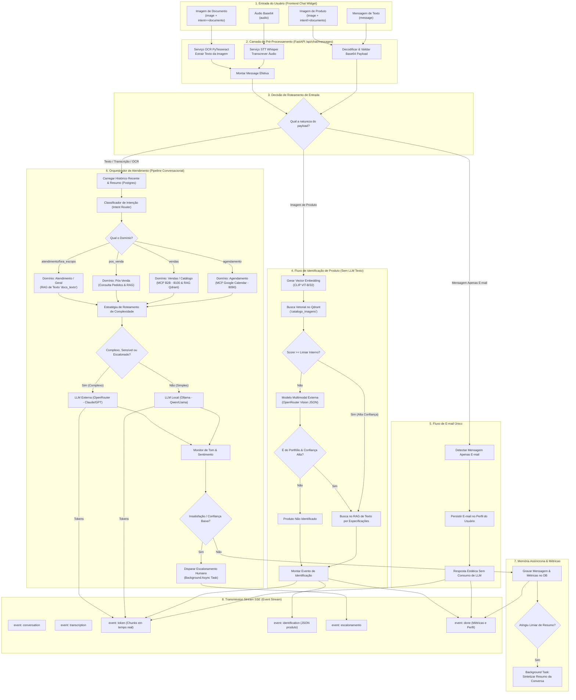
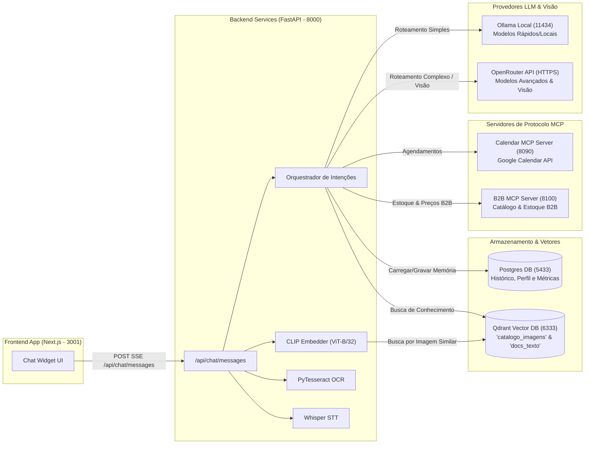

# Diagrama de Usabilidade, Fluxos e Conexões do Chat

Este documento apresenta a arquitetura visual completa do **Chat**, detalhando o ciclo de vida da requisição desde o envio dos payloads no frontend (texto, áudio, imagem de produto, imagem de documento e e-mail) até as decisões do orquestrador, integrações com microsserviços MCP, buscas vetoriais no Qdrant e eventos em tempo real via **Server-Sent Events (SSE)**.

---

## 1. Diagrama de Fluxo e Roteamento de Decisões

---

## 2. Diagrama de Componentes e Integrações do Sistema

O diagrama abaixo ilustra o relacionamento lógico entre as camadas de **Frontend**, **Backend FastAPI**, **Bancos de Dados/Vetores** e **Servidores MCP externos**.

---

## 3. Matriz de Mapeamento: Entradas vs. Redirecionamentos

| Tipo de Entrada | Condição / Payload | Pré-processador | Rota de Execução | Componentes / Integrações Envolvidos | Formato da Resposta SSE |
| :--- | :--- | :--- | :--- | :--- | :--- |
| **Texto Puro** | `message` preenchido | N/A | Pipeline Conversacional Completo | Intent Router $\rightarrow$ RAG / MCP $\rightarrow$ LLM (Ollama/OpenRouter) | `conversation`, `token`, `done` |
| **Áudio** | `audio` (Base64) | Whisper STT (`SttClient`) | Transcrição $\rightarrow$ Pipeline Conversacional | Whisper $\rightarrow$ Intent Router $\rightarrow$ LLM | `conversation`, `transcription`, `token`, `done` |
| **Imagem de Produto** | `image` (Base64) & `intent != "documento"` | Validação de Imagem (PNG/JPG/WEBP) | Identificação por CLIP + Visão + RAG Texto | `ClipEmbedder` $\rightarrow$ Qdrant (`catalogo_imagens`) $\rightarrow$ OpenRouter Vision $\rightarrow$ RAG | `conversation`, `identification`, `token`, `done` |
| **Imagem de Documento** | `image` (Base64) & `intent == "documento"` | PyTesseract OCR (`extract_text_from_base64`) | Extração de Texto $\rightarrow$ Pipeline Conversacional | PyTesseract $\rightarrow$ Anexa texto extraído $\rightarrow$ LLM | `conversation`, `token`, `done` |
| **Apenas E-mail** | `message` é um e-mail válido | Regex de Extração de E-mail | Registro no Perfil + Resposta Fixa | Postgres (`registrar_email`) $\rightarrow$ Resposta Estática | `conversation`, `token`, `done` |

---

## 4. Referências no Código Fonte

- **Endpoint Principal do Chat:** [`src/app/api/chat.py`](file:///home/augusto/Projetos/TCC/backend/src/app/api/chat.py#L300)
- **Identificação por Imagem (CLIP + Visão + RAG):** [`src/app/rag/image_identification.py`](file:///home/augusto/Projetos/TCC/backend/src/app/rag/image_identification.py#L101)
- **Orquestrador de Atendimento e Intenções:** [`src/app/router/orchestrator.py`](file:///home/augusto/Projetos/TCC/backend/src/app/router/orchestrator.py)
- **Motor de OCR:** [`src/app/ocr/image_processor.py`](file:///home/augusto/Projetos/TCC/backend/src/app/ocr/image_processor.py)
- **Gerenciador de Memória e Sessão:** [`src/app/memory/store.py`](file:///home/augusto/Projetos/TCC/backend/src/app/memory/store.py)
