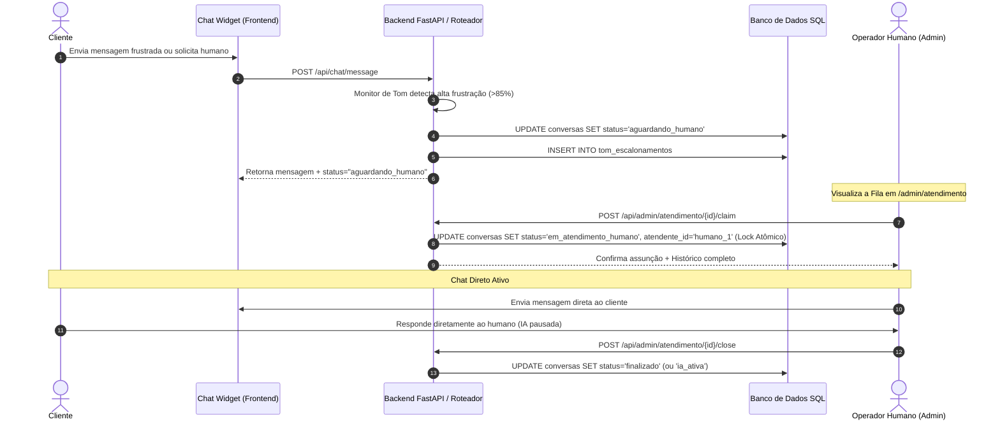

# Especificação Arquitetural: Transbordo para Atendimento Humano e Fila de Suporte (Human-in-the-Loop)

> **Data:** 03 de Outubro de 2026  
> **Status:** Proposta de Arquitetura / Design Spec  
> **Domínio:** Roteador de Atendimento, Monitor de Tom e Central de Suporte Admin

---

## 1. Visão Geral e Objetivos

Esta especificação define a arquitetura para transbordo dinâmico (*Human-in-the-Loop / Live Agent Takeover*) de conversas iniciadas pelo assistente virtual no Chat Público para **atendentes humanos** no Painel Administrativo.

### Objetivos Principais
1. **Transbordo Fluido:** O cliente permanece no mesmo widget de chat sem necessidade de recarregar a página ou abrir novos canais.
2. **Fila de Espera com Locks Atômicos:** Múltiplos atendentes humanos podem visualizar a fila de espera simultaneamente e assumir chats individuais sem risco de concorrência ou duplo atendimento.
3. **Pausa Inteligente da IA:** Quando uma conversa entra em atendimento humano, o gerador de respostas automático (LLM/Roteador) é automaticamente suspenso para aquele `conversation_id`.
4. **Contexto Completo para o Operador:** O atendente humano enxerga todo o histórico prévio da conversa entre o cliente e a IA, incluindo métricas, produtos consultados e o motivo do escalonamento.

---

## 2. Fluxo Arquitetural e Sequência



---

## 3. Modelagem de Dados

### 3.1 Alterações na Tabela `conversas`

| Campo | Tipo | Descrição |
| :--- | :--- | :--- |
| `status` | `VARCHAR` | Estados: `"ia_ativa"`, `"aguardando_humano"`, `"em_atendimento_humano"`, `"finalizado"` |
| `atendente_id` | `VARCHAR` (Null) | Identificador/e-mail do operador humano que assumiu o chat |
| `motivo_escalonamento` | `VARCHAR` (Null) | Motivo (ex: `"tom_frustrado"`, `"solicitacao_direta"`, `"duvida_financeira"`) |
| `prioridade` | `INTEGER` | Nível de prioridade na fila (1 = Baixa, 5 = Crítica) |
| `escalado_em` | `TIMESTAMP` | Carimbo de data/hora de entrada na fila |

### 3.2 Alterações na Tabela `conversa_mensagens`

| Campo | Tipo | Descrição |
| :--- | :--- | :--- |
| `papel` | `VARCHAR` | Valores aceitos: `"cliente"`, `"assistente"` (IA) ou `"atendente"` (Humano) |
| `atendente_nome` | `VARCHAR` (Null) | Nome de exibição do atendente humano para exibição no widget do cliente |

---

## 4. Regras de Negócio e Mecanismo de Lock Atômico

1. **Suspensão da IA:**
   - Durante o processamento de qualquer mensagem no endpoint `/api/chat/message`, o backend verifica:
     ```python
     if conversa.status in ("aguardando_humano", "em_atendimento_humano"):
         # Grava a mensagem do cliente no banco, mas NÃO invoca o LLM
         return Response(status="pausado_para_atendimento_humano")
     ```

2. **Claim Atômico da Conversa:**
   - Para evitar que dois operadores cliquem simultaneamente no mesmo chat da fila:
     ```sql
     UPDATE conversas
     SET status = 'em_atendimento_humano',
         atendente_id = :operador_id,
         atualizada_em = NOW()
     WHERE id = :conversa_id
       AND status = 'aguardando_humano'
       AND atendente_id IS NULL;
     ```
   - Se 0 linhas forem afetadas, o backend retorna um erro HTTP 409 (Conflito), informando ao operador que o chat acabou de ser assumido por outro colega.

---

## 5. Interface da Central de Atendimento Humano (`/admin/atendimento`)

A interface administrativa é composta por 3 colunas funcionais:

1. **Painel da Fila (Esquerda):**
   - Lista todas as conversas com `status = "aguardando_humano"`.
   - Exibe indicador visual de tom (Badge vermelho para tom frustrado, amarelo para solicitação direta), tempo decorrido na fila e botão **"Assumir Chat"**.

2. **Meus Chats Ativos (Centro/Abas):**
   - Abas dos chats atualmente sob responsabilidade do operador conectado.
   - Histórico em tempo real com diferenciação visual de balões (Cliente = Cinza/Azul, IA = Roxo, Humano = Verde).

3. **Painel de Contexto do Cliente (Direita):**
   - Resumo automático gerado pelo RAG/LLM.
   - Classificação do perfil (Cliente cadastrado vs Esporádico), e-mail e histórico de compras.

---

## 6. Transição de Encerramento

Ao concluir o atendimento, o operador possui duas opções na interface:
- **Encerrar Atendimento (`status = "finalizado"`):** Fecha a sessão. O cliente recebe uma mensagem de encerramento e convite para avaliação.
- **Devolver para IA (`status = "ia_ativa"`):** Libera o bot para voltar a responder automaticamente perguntas subsequentes sobre catálogo/estoque.

---

## 7. Próximos Passos de Implementação

1. Criar migração Alembic para adicionar as colunas `status`, `atendente_id`, `motivo_escalonamento` e `escalado_em` na tabela `conversas`.
2. Atualizar o orquestrador (`app/router/orchestrator.py`) para respeitar a pausa da IA quando `status != "ia_ativa"`.
3. Criar os endpoints de suporte em `app/api/admin_atendimento.py`:
   - `GET /api/admin/atendimento/fila`
   - `POST /api/admin/atendimento/{id}/claim`
   - `POST /api/admin/atendimento/{id}/mensagem`
   - `POST /api/admin/atendimento/{id}/close`
4. Desenvolver o componente da Central de Atendimento no frontend (`frontend/app/admin/atendimento/page.tsx`).
