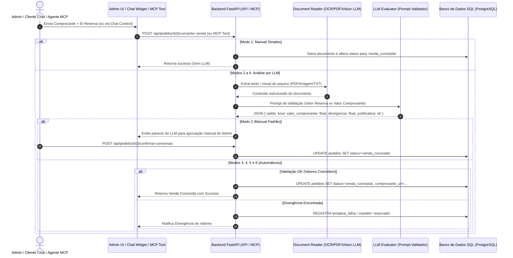

# Especificação Arquitetural: Conversão de Reserva em Venda com Comprovação Multimodal

> **Data:** 05 de Outubro de 2026  
> **Status:** Proposta de Arquitetura / Design Spec  
> **Domínio:** Pedidos, MCP B2B, Chat Multimodal (B2C/B2B) e Painel Administrativo

---

## 1. Visão Geral e Objetivos

Esta especificação define a arquitetura e o fluxo funcional para a **conversão de reservas em vendas efetivadas** no sistema, suportando validação por documentos de comprovação de pagamento (Imagem, PDF e TXT) processados via LLM interno multimodal.

O sistema suportará **5 modalidades de conversão** (por canal de efetivação):
1. **Manual Simples (Admin):** O administrador altera o status da reserva para venda no painel, podendo anexar opcionalmente um comprovante (sem análise de LLM).
2. **Manual Padrão (Admin com Assistência de IA):** O administrador envia o comprovante, o LLM analisa e exibe o parecer (valores da reserva vs. comprovante), e o admin confirma manualmente a conversão.
3. **Automática (Admin):** O admin envia o comprovante; o LLM valida se o valor bate com o total da reserva e, se verificado com sucesso, o sistema converte automaticamente para venda.
4. **Automática (Cliente via Chat):** O cliente envia o comprovante no chat; o pipeline multimodal processa o arquivo ou texto, confirma o valor com a reserva ativa (independente de quantidade ou descontos aplicados) e converte o pedido para venda, emitindo a confirmação no chat.
5. **Automática (Parceiro B2B via MCP / Integrador):** O parceiro B2B chama a ferramenta MCP (`converter_reserva_venda`) enviando o ID da reserva e o comprovante (base64, URL ou texto); o servidor MCP roda a validação por LLM e efetiva a conversão.

---

## 2. Fluxo Arquitetural e Diagrama de Sequência



---

## 3. Modelagem de Dados

### 3.1 Alterações na Tabela `pedidos`

Novos campos na tabela `pedidos` (tabela modelada em [`models.py`](file:///home/augusto/Projetos/TCC/backend/src/app/db/models.py)):

| Campo | Tipo | Descrição |
| :--- | :--- | :--- |
| `status` | `VARCHAR(50)` | Novos estados: `"reservado"`, `"venda_concluida"`, `"pagamento_divergente"` |
| `comprovante_url` | `VARCHAR(255)` (Null) | Caminho relativo do arquivo de comprovante armazenado |
| `tipo_conversao` | `VARCHAR(50)` (Null) | Enum: `"manual_simples"`, `"manual_padrao"`, `"auto_admin"`, `"auto_chat"`, `"auto_mcp_b2b"` |
| `convertido_em` | `TIMESTAMP` (Null) | Data/hora exata em que a conversão foi efetivada |
| `convertido_por` | `VARCHAR(100)` (Null) | Identificador de quem efetuou ou autorizou (e-mail do admin, "sistema_llm", "mcp_partner") |
| `llm_parecer` | `TEXT` (Null) | JSON/Texto com o resultado da avaliação do LLM (valor extraído, divergência e justificativa) |

---

## 4. O Pipeline de Leitura Multimodal do Comprovante

O backend utilizará a infraestrutura já existente no projeto para leitura de mídias:
1. **Arquivos PDF:** Processados pelo extrator estruturado `pdf_extract` ([`pdf_extract.py`](file:///home/augusto/Projetos/TCC/backend/src/app/rag/pdf_extract.py)).
2. **Arquivos de Imagem (JPG/PNG):** Processados via OCR (Tesseract) e/ou modelo LLM de visão computacional (`Ollama` local ou `OpenRouter` multimodal).
3. **Arquivos de Texto (TXT):** Leitura direta de conteúdo em UTF-8.

### Prompt de Avaliação de Comprovante (LLM Evaluator)
O prompt envia as informações do pedido (Número do Pedido, Valor Total Devido, Nome do Comprador) juntamente com o texto/imagem extraído do comprovante:

```json
{
  "reserva_id": "123e4567-e89b-12d3-a456-426614174000",
  "valor_devido": 1500.00,
  "comprovante_valido": true,
  "valor_pago_detectado": 1500.00,
  "divergencia": 0.00,
  "codigo_transacao": "E12345678202610051200",
  "justificativa": "Comprovante PIX válido com valor correspondente exatamente ao valor devido da reserva."
}
```

---

## 5. Detalhamento das 5 Modalidades de Conversão

### 1. Manual Simples (Admin)
- **Endpoint:** `POST /api/admin/pedidos/{id}/converter-manual-simples`
- **Upload:** Arquivo opcional.
- **Ação:** Altera o status para `"venda_concluida"` diretamente. Salva `tipo_conversao = "manual_simples"`.

### 2. Manual Padrão (Admin + Assistência de LLM)
- **Endpoint:** `POST /api/admin/pedidos/{id}/analisar-comprovante`
- **Upload:** Obrigatório (PDF, Imagem ou TXT).
- **Ação:** Retorna o JSON de parecer do LLM. O painel exibe um modal comparando o valor cobrado vs. valor detectado.
- **Confirmação:** Admin clica em `POST /api/admin/pedidos/{id}/confirmar-conversao` para efetivar a venda.

### 3. Automática (Admin)
- **Endpoint:** `POST /api/admin/pedidos/{id}/converter-auto-admin`
- **Upload:** Obrigatório.
- **Ação:** Invoca a análise do LLM. Se `divergencia == 0.00`, converte para `"venda_concluida"` automaticamente e registra `tipo_conversao = "auto_admin"`. Se houver divergência, retorna erro e altera status para `"pagamento_divergente"`.

### 4. Automática via Chat (Cliente / Usuário)
- **Fluxo:** O cliente envia o comprovante no chat (`POST /api/chat/message` com anexo de imagem, PDF ou texto de PIX/TED).
- **Orquestrador:** Roteador detecta a intenção de comprovante e busca a reserva ativa da sessão (`conversation_id` ou `user_email`).
- **Ação:** O LLM compara o valor pago no comprovante com o valor devido da reserva ativa (já calculado e faturado na emissão da reserva, independente de quantidade ou faixas de desconto acordadas). Se validado, converte a reserva em venda (`tipo_conversao = "auto_chat"`). O assistente responde: *"Seu pagamento foi confirmado com sucesso! O comprovante no valor de R$ X,XX foi validado com êxito. Sua reserva foi convertida em venda concluída."*

### 5. Automática via MCP Tool B2B (`converter_reserva_venda`)
- **Servidor MCP:** Exposição no servidor B2B em [`b2b.py`](file:///home/augusto/Projetos/TCC/backend/src/app/mcp_server/b2b.py).
- **Ferramenta:** `converter_reserva_venda(pedido_id: str, comprovante_base64_ou_texto: str, nome_arquivo: str)`
- **Ação:** O backend MCP executa o pipeline de leitura LLM. Se validado, converte a reserva para `"venda_concluida"` (`tipo_conversao = "auto_mcp_b2b"`) e devolve a resposta estruturada para o agente integrador.

---

## 6. Próximos Passos e Integrações

1. Criar migração Alembic para atualizar a tabela `pedidos`.
2. Implementar o serviço de validação de comprovantes em `app/services/comprovante_evaluator.py`.
3. Adicionar os endpoints administrativos no backend e a interface no frontend Admin (`/admin/pedidos`).
4. Adicionar a tool `converter_reserva_venda` no servidor MCP B2B e no cliente B2B.
5. Atualizar a documentação do projeto (`ARCHITECTURE.md`, `ROADMAP.md` e `PROMPTS_E_INSTRUCOES_LLM.md`).
